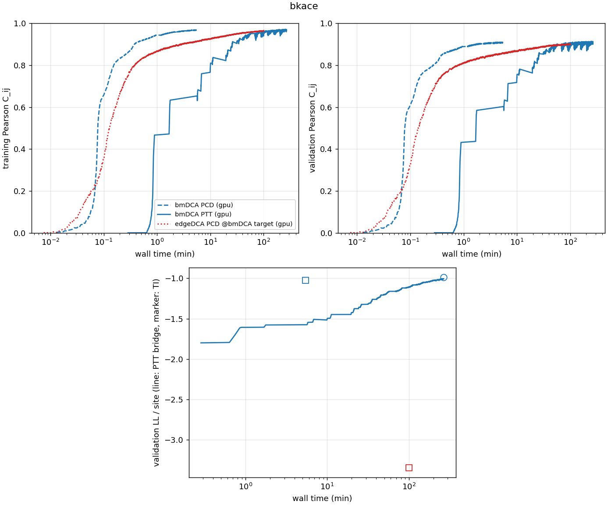
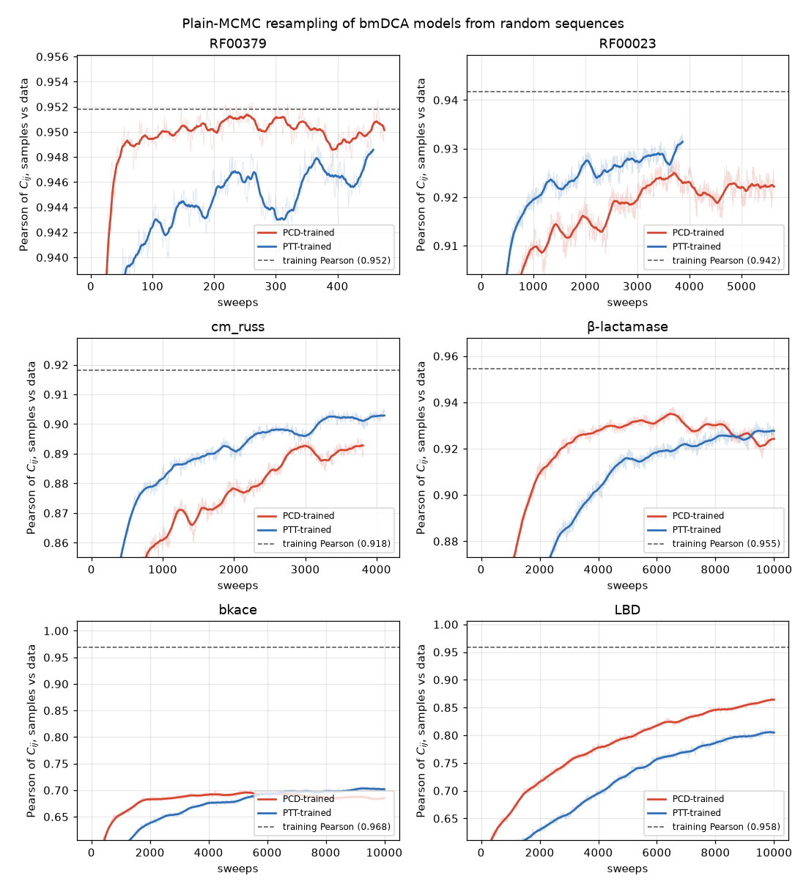

# Benchmarks

What to expect from adabmDCA on real data, and how the training strategies, model types, samplers and devices compare. Six families were trained and sampled with every combination of interest on one workstation (NVIDIA RTX A5000; AMD Threadripper PRO 5955WX, 16 threads for CPU runs), one job at a time so that wall times are comparable. A separate [MPS vs CPU](#mps-vs-cpu) comparison below uses an Apple M4 laptop.

## Setup

| Family | Type | L | q | Training sequences | M_eff | Validation sequences | M_eff |
| --- | --- | --- | --- | --- | --- | --- | --- |
| RF00379 | RNA | 136 | 5 | 2,908 | 1,109 | 738 | 429 |
| RF00023 | RNA | 374 | 5 | 6,484 | 2,686 | 1,621 | 937 |
| cm_russ_natural | protein | 96 | 21 | 901 | 573 | 225 | 225 |
| bkace | protein | 272 | 21 | 13,058 | 3,525 | 3,265 | 816 |
| LBD | protein | 279 | 21 | 13,864 | 1,149 | 6,945 | 5,415 |
| beta_lactamase | protein | 215 | 21 | 128,419 | 39,255 | 32,665 | 10,178 |

Each family was split 80/20 into training and validation sets by clustering at 80% identity. LBD's training set is far more redundant than its validation set (M_eff 1,149 vs 5,415), which partly explains its lower validation Pearson.

Protocol, per family, with default settings except `--nsweeps 100` for cm_russ_natural and LBD:

1. bmDCA with **PTT** and the validation set, stopping at the validation plateau;
2. bmDCA with **PCD**, with `--target` set to the training Pearson the PTT run ended with;
3. **edgeDCA** with PCD at the same target;
4. 2,000 sequences from each model: PTT sampling and plain MCMC for the PTT model, plain MCMC for the others, with `--plot` and the validation set as `-v`;
5. \(\log Z\) of every model by thermodynamic integration, so that PCD models also get a validation likelihood.

Jobs had a 10-hour cap and PTT sampling a 3,000-round cap. The cap stopped LBD PTT training at update 3,582, with the validation likelihood still rising slowly, and bkace PTT sampling before renewal: its old fraction was still decreasing, but more and more slowly, and would have needed about 500 more rounds ([details](sampling.md#population-renewal)). Plain MCMC was given up to 10,000 sweeps. One seed per configuration: differences of a few thousandths in Pearson or about 0.01 nats per site in likelihood are within run-to-run and estimator noise.

## Training: PCD vs PTT

PCD was trained to the training Pearson the PTT run ended with. "First reaches" is when PTT's rolling mean first got there; PTT then continued to its validation plateau.

| Family | Target Pearson | PTT total | PTT first reaches | PCD | PCD speed-up | Validation Pearson PTT / PCD |
| --- | --- | --- | --- | --- | --- | --- |
| RF00379 | 0.952 | 2.9 min | 2.9 min | 0.3 min | 9× | 0.806 / 0.801 |
| cm_russ_natural | 0.918 | 31 min | 30 min | 3.3 min | 9× | 0.604 / 0.609 |
| RF00023 | 0.942 | 58 min | 54 min | 1.7 min | 32× | 0.851 / 0.851 |
| beta_lactamase | 0.955 | 106 min | ≈ 106 min | 9.9 min | 11× | 0.942 / 0.945 |
| bkace | 0.968 | 267 min | 196 min | 5.4 min | 36× | 0.904 / 0.909 |
| LBD | 0.958 | 600 min (cap) | 506 min | 12.4 min | 41× | 0.826 / 0.842 |

Validation log-likelihood per site, both from thermodynamic integration for a like-for-like comparison:

| Family | PTT | PCD | PTT − PCD | Agreement of PTT bridge and TI |
| --- | --- | --- | --- | --- |
| RF00379 | −0.706 | −0.706 | 0.000 | 0.000 |
| cm_russ_natural | −1.477 | −1.479 | +0.002 | 0.007 |
| RF00023 | −0.643 | −0.646 | +0.003 | 0.009 |
| beta_lactamase | −1.328 | −1.357 | **+0.029** | 0.001 |
| bkace | −0.988 | −1.023 | **+0.035** | 0.015 |
| LBD (capped) | −1.677 | −1.702 | **+0.025** | 0.012 |

On the three easier families the held-out likelihoods are indistinguishable. This does not make the models equivalent: resampling shows that the RF00023 PCD model was trained out of equilibrium ([below](#out-of-equilibrium-training-seen-in-resampling)). On the three large protein families, PTT ends about 0.03 nats per site higher on held-out data, above the uncertainty of the estimate. **Equal training Pearson does not mean equal models.** PTT also reaches a much higher training likelihood (bkace −0.72 vs −0.84; LBD −0.86 vs −0.95), because it keeps fitting until the validation likelihood stops improving.

[{ width="860" }](../figures/benchmarks/training_bkace.png)

*bkace, against wall time (log scale). PCD (dashed) reaches high Pearson within minutes. PTT (solid) starts after initialization, rises in steps as the ladder grows, and keeps improving the validation likelihood (bottom; line: PTT estimate during training, markers: thermodynamic integration of the final models) for hours. The PCD model's validation likelihood (blue square) is below PTT's final value (circle); the edgeDCA PCD model (red square) is far below.*

## Sampling: PTT vs plain MCMC

Pearson of the generated vs training connected correlations, 2,000 sequences. **×** marks plain MCMC runs that did not reach a mixing time within 10,000 sweeps.

| Family | PTT model, PTT sampling | PTT model, MCMC | PCD model, MCMC | Time: PTT / MCMC |
| --- | --- | --- | --- | --- |
| RF00379 | 0.949 | 0.949 | 0.950 | 27 s / 17 s |
| cm_russ_natural | 0.908 | 0.904 | 0.890 | 56 s / 31 s |
| RF00023 | 0.938 | 0.931 | 0.923 | 16 min / 2 min |
| beta_lactamase | **0.945** | 0.928 × | 0.925 × | 27 min / 13 min |
| LBD | **0.956** | 0.813 × | 0.865 × | 32 min / 18 min |
| bkace | **0.962** | 0.702 × | 0.685 × | 62 min / 16 min |

- On RF00379, RF00023 and cm_russ_natural, plain MCMC reached its mixing time for every bmDCA model, in half the time of PTT sampling or less. For the PTT models it agreed with PTT sampling within 0.007. The PCD models resampled lower than the PTT models trained to the same target (RF00023 0.923 vs 0.931, cm_russ 0.890 vs 0.904), and the RF00023 PCD model shows the out-of-equilibrium signature described below.
- On beta_lactamase, LBD and bkace, **plain MCMC does not mix, for either model**. The low Pearsons are a sampling failure, not necessarily a model failure, and the PCD models cannot be properly checked without a ladder. On bkace, MCMC samples over- and under-populate data clusters by up to 2× (deviations up to 16 standard errors), while PTT samples match every cluster share within noise (largest deviation ×0.80 ± 0.07). [Sampling](sampling.md#plain-mcmc) shows the PCA projections.
- The sampled Pearson of a PTT model is close to its training value at equal sample size (training: 0.952, 0.918, 0.942, 0.955, 0.958, 0.968).

## Out-of-equilibrium training seen in resampling

Plain MCMC resampling starts from random sequences, and the Pearson with the data is recorded at every sweep (`pearson_sampling.png`, `logs/sampling.log`). For a model whose equilibrium matches the data, the Pearson rises and settles on a plateau. When it instead **rises above its final level and then declines**, the chains pass through a transient that matches the data better than the model's own equilibrium. The model has learned to reproduce the data at a finite sampling time, which is what happens when training chains are not at equilibrium. The converse does not hold. A steady rise to a plateau is compatible with a model trained out of equilibrium whose relaxation is too slow to show the decline, or with chains stuck in one region of a multimodal model.

[{ width="800" }](../figures/benchmarks/mcmc_pearson_pcd_vs_ptt.png)

*bmDCA models trained with PCD (red) and PTT (blue) to the same training Pearson (dashed), resampled with plain MCMC from random sequences; thick lines are smoothed. On β-lactamase and bkace, the PCD-trained curve rises faster, peaks, declines, and is overtaken by the PTT-trained one. On RF00023 it peaks around 3,700 sweeps and settles 0.003–0.005 lower, although the mixing time was reached. RF00379 runs too few sweeps (twice the mixing time, 476) to show a slow decline.*

Runs whose smoothed Pearson dropped by at least 0.005 after a peak:

| Model | Peak (sweeps) | End | Drop | MCMC mixing time reached |
| --- | --- | --- | --- | --- |
| β-lactamase, bmDCA PCD | 0.935 (6,500) | 0.922 | 0.013 | no |
| bkace, bmDCA PCD | 0.696 (5,300) | 0.684 | 0.012 | no |
| RF00023, bmDCA PCD | 0.925 (3,700) | 0.922 | 0.005 | yes |
| RF00023, edgeDCA PCD | 0.897 (2,200) | 0.889 | 0.009 | yes |
| cm_russ, edgeDCA PCD (edgeDCA target) | 0.640 (6,800) | 0.620 | 0.020 | no |
| cm_russ, edgeDCA PCD (bmDCA target) | 0.712 (7,500) | 0.705 | 0.008 | no |

- **Every such run is a PCD-trained model.** None of the nine PTT-trained models (bmDCA and edgeDCA) shows a decline beyond sweep-to-sweep noise (largest 0.003).
- **Reaching the mixing time does not exclude it.** Both RF00023 PCD models reached their mixing time and still show the signature: the mixing-time criterion only checks that chains forget their recent past.
- **A steady rise is not a certificate.** The PTT-trained models on β-lactamase, bkace and LBD, and the PCD-trained ones on LBD and cm_russ, rise steadily, yet none of the first four reached equilibrium within 10,000 sweeps, and the cm_russ PCD model levels off 0.026 below its training value.

## Diversity and memorization

| Family | Validation: median nearest-neighbour distance (share < 0.1) | Generated (bmDCA, all variants) | Generated → training vs validation → training |
| --- | --- | --- | --- |
| RF00379 | 0.162 (33%) | 0.31–0.32 (0%) | 0.29 vs 0.23 |
| RF00023 | 0.182 (23%) | 0.385–0.388 (0%) | 0.36 vs 0.13 |
| cm_russ_natural | 0.448 (0%) | 0.458 (0%) | 0.41 vs 0.40 |
| beta_lactamase | 0.247 (28%) | 0.53–0.54 (0%) | 0.48 vs 0.24 |
| bkace | 0.077 (58%) | 0.38–0.40 (0%) | 0.35 vs 0.22 |
| LBD | 0.366 (9%) | 0.42–0.46 (0%) | 0.38–0.42 vs 0.43 |

- **No model reproduces the redundancy of natural data.** Natural validation sets contain many near-duplicates (up to 58% of sequences within 10% of another one); no generated set does, and PTT and PCD do not differ here. Most of the effect comes from reweighting, but not all: on RF00379, a model trained without reweighting generated 4.6% near-duplicates against 26% in the data, since a pairwise model cannot reproduce the phylogenetic structure of the alignment ([details](input.md#reweighting-and-the-redundancy-of-generated-sequences)).
- **All-pair distances match.** The distribution of distances between all pairs of generated sequences matches that of the validation set closely (mean quantile gap 0.005–0.05).
- **No memorization.** Generated sequences sit farther from the training set than held-out sequences do, or at a comparable distance (cm_russ_natural, LBD). The margin is largely a consequence of reweighting: without it, RF00379 samples sat exactly as close to the training set as held-out sequences, still with no identical sequence.

## bmDCA vs edgeDCA

| Family | Run | Time | Train / val Pearson | Density | Val LL (TI) | Resampled Pearson (MCMC) |
| --- | --- | --- | --- | --- | --- | --- |
| RF00379 | bmDCA PTT | 2.9 min | 0.952 / 0.806 | 1.00 | −0.706 | 0.949 |
| | edgeDCA PTT | 2.1 min | 0.892 / 0.781 | 0.13 | −0.712 | 0.892 |
| | edgeDCA PCD, edge target | 5 s | 0.892 / 0.782 | 0.08 | −0.736 | 0.884 |
| | edgeDCA PCD, bmDCA target | 7.0 min, step cap | 0.936 / 0.775 | 0.41 | unreliable | 0.928 × |
| RF00023 | bmDCA PTT | 58 min | 0.942 / 0.851 | 1.00 | −0.643 | 0.931 |
| | edgeDCA PTT | 77 min | 0.901 / 0.826 | 0.14 | −0.681 | 0.897 |
| | edgeDCA PCD, bmDCA target | 33 min, step cap | 0.905 / 0.814 | 0.27 | unreliable | 0.887 × |
| cm_russ_natural | bmDCA PTT | 31 min | 0.918 / 0.604 | 1.00 | −1.477 | 0.904 |
| | edgeDCA PTT | 36 min | 0.811 / 0.531 | 0.32 | −1.615 | 0.801 |
| | edgeDCA PCD, bmDCA target | 1.2 min | 0.919 / 0.572 | 0.23 | unreliable | 0.701 × |
| beta_lactamase | edgeDCA PCD, bmDCA target | 36 min, step cap | 0.837 / 0.828 | 0.03 | unreliable | 0.815 × |
| bkace | edgeDCA PCD, bmDCA target | 101 min, step cap | 0.964 / 0.900 | 0.31 | unreliable | 0.507 × |
| LBD | edgeDCA PCD, bmDCA target | 36 min | 0.958 / 0.850 | 0.11 | unreliable | 0.548 × |

("Step cap": stopped at the default 50,000 graph updates before reaching the target.)

- **edgeDCA with PTT** took as long as bmDCA or longer, stopped at a lower Pearson, and had an equal or lower validation likelihood. Its archives accumulated many models, which made PTT sampling expensive: on RF00023, 47 models and 89 minutes of sampling without reaching renewal.
- **edgeDCA with PCD** is very fast to a moderate target. At bmDCA-level targets, 4 of 6 families exhausted the step budget (beta_lactamase stalled at 0.84 with 3% density), and **the models did not mix**: their resampled Pearsons fell far below training (bkace 0.51 vs 0.96, LBD 0.55 vs 0.96, cm_russ 0.70 vs 0.92). Their energy scales were extreme (mean training energy from −100 to −9,200, against +50 to +300 for every other model) and thermodynamic integration returned meaningless \(\log Z\) values. The good training Pearson was a property of the persistent chains, not of the model's equilibrium. The cm_russ model also generated sequences unusually close to the training data (median nearest-training distance 0.23 vs 0.40 for held-out sequences), the only sign of collapse in the whole study.

For these families, bmDCA is better than edgeDCA in accuracy, robustness and total cost. Sparse models are worth it only when sparsity itself is the goal, and then with PTT and on small families.

## Sampling kernels

For Apple GPUs, see [MPS vs CPU](#mps-vs-cpu) below.
For fixed seven-model CPU PTT generation, see the separate
[Numba swap-fusion measurements](numba-swaps.md).

Time per sweep, 2,000 chains, comparing the original PyTorch samplers with the current ones (Triton on GPU, Numba on CPU):

| Model | Device | Gibbs | Metropolis | Metropolized Gibbs |
| --- | --- | --- | --- | --- |
| RF00379 bmDCA | GPU | 23.7 → 0.56 ms (42×) | 17.0 → 0.23 ms (74×) | 35.4 → 0.62 ms (57×) |
| RF00379 bmDCA | CPU | 65.9 → 9.4 ms (7×) | 44.8 → 2.2 ms (21×) | 62.4 → 9.5 ms (7×) |
| cm_russ bmDCA | GPU | 18.1 → 0.75 ms (24×) | 16.0 → 0.45 ms (35×) | 28.3 → 0.75 ms (38×) |
| cm_russ bmDCA | CPU | 152 → 14.2 ms (11×) | 74.4 → 2.1 ms (36×) | 96.4 → 14.7 ms (7×) |

The optimized kernels produce the same Markov chain as the originals (identical decorrelation curves, see [Sampling](sampling.md#local-moves)).

Cost of one independent sample (energy correlation time × time per sweep, 2,000 chains):

| Model | GPU Gibbs | GPU Metr. Gibbs | GPU Metropolis | CPU Gibbs | CPU Metr. Gibbs | CPU Metropolis |
| --- | --- | --- | --- | --- | --- | --- |
| RF00379 (τ ≈ 5 / 7 / 16 sweeps) | 2.9 ms | 4.6 ms | 3.7 ms | 48 ms | 71 ms | 34 ms |
| cm_russ (τ ≈ 71 / 93 / 818 sweeps) | 54 ms | 70 ms | 365 ms | 1.0 s | 1.4 s | 1.7 s |

**Sparse kernels.** For sparse models, kernels that read only the coupled pairs are selected automatically: on CPU while at most half of the pairs are coupled, on GPU while every position is coupled to at most 40% of the others (60% for Metropolis). On CPU they were 2.3–4× faster for Gibbs-type samplers at 13–32% pair density; on GPU at most 1.5×, and Metropolis was slightly slower. `ADABMDCA_SPARSE=0` forces the dense kernels; results are identical up to floating-point rounding.

## GPU vs CPU

bmDCA training with identical settings on the GPU and on the CPU (16 threads, Numba kernels). Training times exclude loading and setup:

| Family | Strategy | GPU | CPU | GPU speed-up | Same outcome? |
| --- | --- | --- | --- | --- | --- |
| RF00379 | PCD | 19 s | 5.1 min | 16× | Yes: target Pearson 0.952 reached after 2,280 (GPU) and 2,243 (CPU) updates |
| cm_russ_natural | PCD, 100 sweeps | 3.3 min | 39 min | 12× | Yes: target Pearson 0.918 after 2,325 and 2,339 updates |
| RF00379 | PTT | 2.9 min | 35 min | 12× | Yes: validation plateau after 2,475 and 2,632 updates; validation log-likelihood −0.711 per site on both |

The two devices draw different random numbers, so the trajectories differ in detail, but they reach models of the same quality in a similar number of updates. Per sampling sweep, the GPU is 15–20× faster for Gibbs and Metropolized Gibbs and 5–9× for Metropolis, which is cheap on CPU. A small RNA family trains on a CPU in minutes with PCD and in about half an hour with PTT; protein families of a few hundred positions need a GPU.

## MPS vs CPU

Optimized Apple Metal kernels have been written for MPS sampling. They are
selected automatically on supported Apple GPUs and are used by both PCD and PTT.

This comparison uses a **MacBook Air with an Apple M4**: a 10-core CPU
(4 performance and 6 efficiency cores), an 8-core Apple GPU and 16 GB of unified
memory. CPU runs use the optimized Numba kernels with **4 threads**; MPS runs
use the optimized Apple Metal kernels. This is a laptop, separate from the
Threadripper/RTX A5000 workstation used above. Runs use PyTorch 2.13.0,
float32, with one job running at a time.

**Sampling.** Time per sweep for 2,000 chains on the same dense bmDCA model,
measured over 10 sweeps after warmup; median of three calls, including the
sampler's input/output conversions:

| Family | Sampler | CPU (Numba) | MPS (Apple Metal) | MPS speed-up |
| --- | --- | --- | --- | --- |
| RF00379 | Gibbs | 20.7 ms | 5.6 ms | 3.7× |
| RF00379 | Metropolis | 6.4 ms | 2.1 ms | 3.1× |
| RF00379 | Metropolized Gibbs | 21.9 ms | 5.7 ms | 3.9× |
| cm_russ_natural | Gibbs | 59.4 ms | 12.4 ms | 4.8× |
| cm_russ_natural | Metropolis | 9.0 ms | 8.5 ms | 1.1× |
| cm_russ_natural | Metropolized Gibbs | 48.7 ms | 5.9 ms | 8.3× |

**PCD training.** Dense bmDCA, 2,000 chains, **10 sweeps per update for both
families**, Metropolized Gibbs, learning rate 0.01, seed 0 and sequence
reweighting at 80% identity.
The target Pearsons match the endpoints of the earlier PTT runs. Training
uses the same `example_data` training/validation splits listed in the setup
above. Times exclude loading, setup and compilation.

| Family | Target Pearson | CPU (Numba) | MPS (Apple Metal) | MPS speed-up | Updates CPU / MPS |
| --- | --- | --- | --- | --- | --- |
| RF00379 | 0.952 | 8.1 min | 2.5 min | 3.3× | 2,221 / 2,226 |
| cm_russ_natural | 0.918 | 14.1 min | 4.7 min | 3.0× | 2,314 / 2,339 |

Both devices reached the requested targets. Their random streams differ,
so the update counts need not match. These are single training runs; speed-ups
apply to this laptop and these settings. In particular, the protein run uses
10 sweeps here, versus 100 in the workstation comparison above. Reaching the
training Pearson alone does not establish equilibrium or equal validation quality.
The [measurement record](../assets/benchmarks/mps-cpu-convergence-m4.json) contains
the individual sampling timings and final training metrics.

## 10 vs 100 local sweeps

On bkace, bmDCA PTT with 100 local sweeps per round was compared with the 10-sweep reference over updates 1,000–6,000 (the 100-sweep run stopped at the 10-hour cap):

| | 10 sweeps | 100 sweeps |
| --- | --- | --- |
| Update-to-update noise of Pearson / val Pearson / slope | 0.0024 / 0.0039 / 0.031 | 0.0013 / 0.0024 / 0.019 |
| Chain lag, median / max | 0.022 / 0.20 | 0.007 / 0.06 |
| Lag pauses | 2 | 0 |
| Smallest swap acceptance | Pinned at 0.25 from update ~2,000 | Regular saw-tooth, 0.25–0.45 |
| Log-likelihood per site at update 6,000, train / val | −0.949 / −1.079 | −0.869 / −1.038 |
| Time per update | 1.0 s | 6.0 s |
| Best validation log-likelihood | −1.008 at the plateau (4.4 h) | −1.038 at the cap (10 h) |

More local work gives a smoother optimization and more progress per update, but costs about 6× more per update, so 10 sweeps reach a given validation likelihood sooner. The [training page](training.md#a-larger-family-what-10-and-100-sweeps-look-like) shows the curves. On cm_russ_natural, in contrast, 10 sweeps failed outright ([F1](diagnostics.md#f1-a-narrow-basin-traps-configurations)) and 100 were needed.

## Summary

| Question | Answer from these families |
| --- | --- |
| PCD or PTT for bmDCA? | PTT for the reference model, PCD for a fast first pass. Same held-out likelihood on easy families, though resampling can still reveal a PCD model trained out of equilibrium; PTT better by ~0.03 nats/site on large proteins, and the only one whose samples could be shown to be at equilibrium |
| How to sample? | PTT from the training archive whenever plain MCMC does not report a reached mixing time |
| bmDCA or edgeDCA? | bmDCA |
| Which sampler? | Gibbs or Metropolized Gibbs |
| GPU or CPU? | GPU for protein families; CPU is fine for small RNA families |
