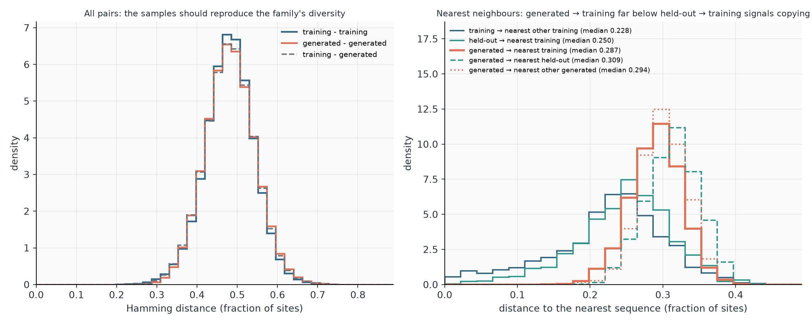

# Diagnose a run

This page explains how training and sampling go wrong, how to recognize each failure in the files a run writes, and what to change. It collects what was learnt on several protein and RNA families; each recommendation states the evidence behind it, and ideas that were tried and did not work are listed at the end so they are not tried again.

## What can go wrong

Every gradient step needs the model's statistics, which are estimated from the chains at the top of the PTT ladder. Everything rests on one assumption: **those chains are at equilibrium for the current model.** The training metrics are computed from the same chains, so if the assumption fails, the gradient is wrong *and* the metrics cannot show it.

The safeguards, and what each one watches:

| Mechanism | Watches | Does |
| --- | --- | --- |
| Snapshot insertion | Swap acceptance of the top link | Inserts a model below the endpoint when acceptance drops below 0.25 |
| Reservoir refresh | Size of the active ladder | Collects equilibrium samples of a recent model, drops older rungs |
| Mixing checks | Whether every configuration is eventually replaced by one born later at the bottom | A failure triggers recovery |
| Recovery | Failed mixing checks | Restores the newest checkpoint that passes a check, halves the learning rates; stops after 3 |
| Lag pause | Correlation between the chains and the energy changes recent updates imposed on them | Inserts a snapshot and lets the chains catch up |

The failures observed so far fall into three groups:

1. **A narrow mode forms faster than the chains can follow** (often a subfamily with a block of gaps). The chains under-populate it, the gradient keeps deepening it, and the model ends up giving it much more weight than the data. The most damaging failure, because the training metrics still look fine: [F1](#f1-a-narrow-basin-traps-configurations), [F2](#f2-the-chains-fall-behind-a-forming-mode), [F6](#f6-good-metrics-miscalibrated-model).
2. **The ladder cannot transport configurations**: a link is too wide, or local relaxation too slow. Training stalls in a mixing check or reservoir collection, then rolls back: [F3](#f3-a-ladder-link-is-too-wide), [F4](#f4-the-replicas-relax-too-slowly).
3. **Steps too large** for the chains: [F5](#f5-the-learning-rate-is-too-large).

## Decision table

| You see | Most likely | Do |
| --- | --- | --- |
| Error ending with "Restart the training with more local sweeps per round, e.g. `--nsweeps 100`", or log lines "… configurations cannot swap toward the bottom (only local moves free them)" | [F1](#f1-a-narrow-basin-traps-configurations) | Restart from scratch with 10× the sweeps (`--nsweeps 100`). Do not resume |
| Status stuck for tens of minutes in `reservoir warmup`, `reservoir renewal` or `measuring mixing`; `time_s` in `history.csv` barely grows | [F1](#f1-a-narrow-basin-traps-configurations) | Wait for the failure message to confirm, or restart now with `--nsweeps 100` |
| `» pause: drift tail lag …` lines, training continues normally | [F2](#f2-the-chains-fall-behind-a-forming-mode), handled | Nothing. Check the finished model |
| `» pause: … reservoir refresh failed, pause discarded`, or repeated pauses | [F1](#f1-a-narrow-basin-traps-configurations) | As F1 |
| Error naming a link "below the target", with no immobile configurations | [F3](#f3-a-ladder-link-is-too-wide) | Smaller `--lr`, or larger `--ptt-target-acceptance` |
| Error saying "every link accepts at least the target" | [F4](#f4-the-replicas-relax-too-slowly) | More `--nsweeps` |
| Repeated `restored step …; learning rates …` lines, `lr_coupling` halving | F1, F3, F4 or F5 | Read the mixing-failure lines just before each recovery |
| `lr_bias` at ~10⁻¹⁴ and `kl` at 0.01 for most updates | [F5](#f5-the-learning-rate-is-too-large) | Back to the default `--lr 0.01` |
| Training finished, but independent samples disagree with training (Pearson, cluster shares), or the ladder health shows trapped links | [F6](#f6-good-metrics-miscalibrated-model) | Retrain with more `--nsweeps` |
| PTT sampling warns that `G` stopped decreasing or its decay time doubled, or hits `--ptt-max-rounds` | [F7](#f7-slow-or-incomplete-ptt-sampling) | Usually a better training run |
| "PTT initial mixing experiment exceeded its round budget" | [F8](#f8-the-initial-mixing-check-fails) | Check the input |
| PCD model: plain MCMC sampling reaches `--max_nsweeps` without a mixing time | [Checking a PCD model](#checking-a-pcd-model) | Retrain with PTT |
| Plain MCMC resampling: `pearson_sampling.png` rises above its final level, then declines | Model trained out of equilibrium ([Checking a PCD model](#checking-a-pcd-model)) | Retrain with PTT |

## Triage procedure

**1. How did the run end?** Read `training.json` (`data.stop_reason`, `data.converged`, `data.warnings`) or the `[END]` section of the log.

- `validation_plateau`, `target_pearson`, or a budget: the run finished. Go to step 4.
- An error: its message names the cause of the last mixing failure (see the decision table). The restored state is in `ptt.h5`.
- No end and no recent output: the run is stuck. Go to step 2.

**2. Where is it stuck?** The status line names the phase: `optimizing` (normal), `measuring mixing` or `mixing warmup` (a mixing check), `reservoir warmup`, `reservoir renewal` or `collecting reservoir` (a reservoir refresh), `equilibrating replicas`, `recovery warmup`. Each mixing phase has a budget of 20,000 rounds and its own counter. A phase that runs for tens of minutes at the same update is the signature of F1. `time_s` in `history.csv` does not count these phases, so a growing gap between `time_s` and wall time points there too.

**3. Read the events.** `grep '»' adabmDCA.log`, or `events.jsonl`:

| Event | Log line | Meaning |
| --- | --- | --- |
| `ptt_snapshot_*` | `snapshot inserted, swap acceptance 0.24` | Normal ladder growth; `(pause)` when triggered by the lag |
| `ptt_reservoir_refreshed` | `reservoir refreshed: 20000 samples, …, warmup 38 rounds, spacing 76 rounds` | Normal compression. Warmup and spacing in the tens of rounds are healthy; growing values (38 → 51 → 144) are an early warning of F1 |
| `ptt_mixing` with `status: budget_exceeded` | `mixing check budget exceeded: …` | A failed check. `immobile` lists, per rung, old configurations that cannot swap toward the bottom; `blocking: true` means they alone prevent renewal |
| `ptt_lag_pause` | `pause: drift tail lag 0.26 → 0.13, inserted a snapshot` | The chains fell behind and training paused |
| `ptt_recovery`, `ptt_learning_rate` | `restored step 97; learning rates h …, J …` | A rollback |

**4. Read the history** (`history.csv`, or the plots of `plot-training-log`):

| Column | Healthy | Warning sign |
| --- | --- | --- |
| `pearson`, `pearson_val` | Rising, then flat | Sudden drops after a recovery |
| `ll_val` | Rising, then flat; spikes up to 0.01 per site at ladder changes | Falling over hundreds of updates |
| `acceptance_min` | Saw-tooth between ~0.25 and 0.5–0.9 | Long stretches below 0.25, or below 0.1 |
| `replicas` | 2–3 | — |
| `lr_bias`, `lr_coupling` | At `--lr` most of the time | Halved after recoveries; `lr_bias` at the floor most of the time |
| `kl` | Median well below 0.01 (~10⁻³) | Pinned at 0.01 |
| `lag_drift`, `lag_drift_tail` | Below ~0.05 most of the time | Peaks approaching 0.25 |

**5. Check the finished model** as described [below](#checking-a-finished-model). Training metrics alone cannot prove that a model is good.

A short script that collects the main indicators of a PTT run:

```python
import json
from collections import Counter
from pathlib import Path

import pandas as pd


def triage(run_dir, label=""):
    """Key indicators of a PTT training run, from its history and events."""
    prefix = f"{label}_" if label else ""
    run = Path(run_dir)
    history = pd.read_csv(run / f"{prefix}history.csv")
    events = [json.loads(line) for line in open(run / f"{prefix}events.jsonl")]
    counts = Counter(event["event"] for event in events)
    failed = [e for e in events if e["event"] == "ptt_mixing" and e.get("status") not in (None, "converged")]
    immobile = [entry for e in failed
                for entry in (e.get("immobile") or (e.get("reservoir_renewal") or {}).get("immobile") or [])
                if entry.get("blocking")]
    summary_file = run / f"{prefix}training.json"
    summary = json.loads(summary_file.read_text())["data"] if summary_file.exists() else {}
    last = history.iloc[-1]
    return {
        "stop_reason": summary.get("stop_reason"),
        "updates": int(last.step),
        "pearson": round(float(last.pearson), 4),
        "best_val_ll": round(float(history.ll_val.max()), 4),
        "failed_mixing_checks": len(failed),
        "blocking_immobile_configurations": max((e["immobile"] for e in immobile), default=0),
        "recoveries": counts["ptt_recovery"],
        "lag_pauses": counts["ptt_lag_pause"],
        "reservoir_refreshes": counts["ptt_reservoir_refreshed"],
        "min_acceptance_seen": round(float(history.acceptance_min.min()), 3),
        "max_lag_drift_tail": round(float(history.lag_drift_tail.max()), 3),
        "lr_bias_at_floor_fraction": round(float((history.lr_bias < 1e-10).mean()), 3),
        "median_kl": float(history.kl.median()),
    }


print(triage("model"))
```

On a healthy protein run (cm_russ, `--nsweeps 100`): `validation_plateau`, no failed checks, no recoveries, smallest acceptance 0.25, largest tail lag 0.195, median KL 9·10⁻⁴. On a failed `--lr 0.1` run of the same family: no stop reason, 5 failed checks, 4 recoveries, field rate at the floor in 60% of the updates, median KL at the 0.01 cap.

## Failure catalogue

### F1. A narrow basin traps configurations

**Symptoms.** Training stalls at one update for tens of minutes in a reservoir refresh or a mixing check, then reports a failure. The log shows lines such as `reservoir collection budget exceeded: …; 61 configurations cannot swap toward the bottom (only local moves free them)`. After 3 recoveries, an error ends with "Restart the training with more local sweeps per round". Before the stall, the warmup and spacing of reservoir refreshes grow (38 → 51 → 144 rounds) and `lag_drift_tail` peaks.

**Confirm.** The failed `ptt_mixing` event lists, for some rung, more `immobile` configurations than the renewal tolerance allows (20 of 2,000), with `blocking: true`. `PTTSampler.ladder_health()` on the archive shows a few percent of one rung's configurations with swap acceptance below 10⁻⁴ toward the rung below, while the link's *mean* acceptance looks normal.

**Mechanism.** Configurations are only replaced at the bottom of the ladder, so to be renewed a configuration must travel down. The model has learned a deep, narrow basin; in cm_russ, a 26-sequence subfamily (1.5% of the weighted data) with a block of 12 gaps. Older models in the ladder give that basin almost no weight, so a configuration inside it practically never swaps down. It can only leave by local moves, which took about 3·10⁵ sweeps per chain there. A renewal phase gives each chain at most 20,000 rounds × 10 sweeps = 2·10⁵, so renewal fails. Because the chains cannot follow the basin as it forms, the gradient also over-deepens it (F6).

**Fix.** Restart training from scratch with 10× more local sweeps per round: `--nsweeps 100`. The chains then follow the basin as it forms, and reservoir collections stay short.

**Do not** resume the failed archive with more sweeps: its model already holds the basin. On the cm_russ state at the stall, a reservoir collection at 100 sweeps still failed, and the immobile configurations grew from 60 to 145. **Do not** rely on recovery: halving the learning rate rebuilds the same ladder and the failure recurs.

**Evidence** (cm_russ, L = 96, 901 training sequences):

| Setting | Outcome |
| --- | --- |
| `--nsweeps 10`, `--lr 0.01` | Basin forms around updates 775–830; stalls at update 907 in a reservoir refresh. Reproduced three times |
| `--nsweeps 100` | Completes at the validation plateau after 2,534 updates. Best validation log-likelihood −1.487 per site (−1.541 at the stall above). Training Pearson 0.918; PTT sampling of the final model 0.930 |
| `--lr 0.1` | Fails earlier: rolled back to update 97 twice, aborts after 3 recoveries at update 256 |

### F2. The chains fall behind a forming mode

**Symptoms.** `» pause: drift tail lag 0.28 → 0.07, inserted a snapshot, …` in the log, preceded by a peak of `lag_drift` or `lag_drift_tail`.

**Mechanism.** When the model forms a new mode, its relaxation time grows; the chains trail the model and the gradient overshoots. The adaptive optimizer measures the lag before every update and, above 0.25, pauses and gives the endpoint a close neighbour ([details](training.md#the-adaptive-optimizer)).

**F1 and F2 are the same failure at different severities.** In both, a mode forms faster than the chains can follow. In F2 the mode is broad enough that some chains enter it: the population's response to the recent updates is still roughly linear, the lag measures it, and a pause lets the chains catch up. In F1 the mode is a deep, narrow basin that chains enter only through rare transitions. The lag is a covariance computed on the configurations present at the endpoint. When almost none of them are in the basin, the linear-response estimate stays small even though the population is far from equilibrium, so the pause fires late or never. The failure then shows up later, as a renewal that cannot complete.

**Fix.** Usually none: the pause is the fix. One pause followed by normal training is a handled event. Pauses followed by `reservoir refresh failed, pause discarded`, or repeated pauses, mean the mode is too narrow for the linear-response estimate: treat it as F1.

**Evidence.** On a 307-residue enzyme family, the pause turned a model that over-weighted a subfamily more than twofold (equilibrium Pearson 0.896) into one that matched the data (0.947), at 7% extra cost ([case study](training.md#the-adaptive-optimizer)). On β-lactamase and bkace it never fired. On cm_russ at 10 sweeps it fired only at the stall, too late: for modes that fill by rare transitions, the linear-response lag underestimates the distance from equilibrium.

### F3. A ladder link is too wide

**Symptoms.** The failure message says that configurations rarely cross a link ("link 1 of 2 (acceptance 0.052, below the target 0.25)") and reports no immobile configurations. `acceptance_min` stays below the target for long stretches.

**Mechanism.** Snapshots are inserted when the *top* link's acceptance drops. If the model moves far between snapshots, or a lower link degrades after compression, neighbouring rungs are too far apart.

**Fix.** A smaller `--lr`, which spaces snapshots more closely, or a larger `--ptt-target-acceptance` (e.g. 0.35), which inserts them earlier. Both cost more updates or rungs.

**Caveat.** On the cm_russ `--lr 0.1` failure, the bottom link's mean acceptance was low (0.052), but the cause was F1: 23% of the configurations above it had acceptance below 10⁻³. Check for immobile configurations before concluding F3.

### F4. The replicas relax too slowly

**Symptoms.** The failure message says every link accepts at least the target, yet the ladder did not renew within the budget.

**Fix.** More `--nsweeps`. Prefer more sweeps per round over more rounds: the budgets count rounds, and each exchange pass costs about as much as a sweep.

### F5. The learning rate is too large

**Symptoms.** `kl` pinned at 0.01, `lr_coupling` below `--lr` and fluctuating, `lr_bias` at about 10⁻¹⁴ for most updates, earlier and more frequent mixing failures.

**Mechanism.** With a large `--lr` the trust region binds at every step. Field and coupling steps change the sequence statistics along strongly correlated directions, so the optimizer spends the whole budget on the couplings and sets the field rate to its floor: the exact optimum of its quadratic model, not a bug. The larger steps move the model faster than the chains can follow, making F1 and F3 more likely. (Occasional updates with the field rate at the floor are normal at any learning rate.)

**Fix.** The default `--lr 0.01`.

### F6. Good metrics, miscalibrated model

**Symptoms.** None during training: Pearson and validation likelihood look normal. This is the silent failure.

**Mechanism.** If a mode formed faster than the chains could follow (F1, F2), the chains under-represent it, the gradient keeps asking for more of it, and the model over-weights it. The chains themselves then report about the data's share, so nothing looks wrong.

**Confirm.**

1. **Sample the finished model independently** and compare its Pearson with the training value at equal sample size. Healthy runs lose 0.003–0.007; the enzyme model above fell from 0.950 to 0.896.
2. **Read the ladder health** of that sampling: trapped-configuration ratios above 2, carried by more than a few configurations, point to a trapped mode.
3. **Compare cluster weights** (PCA plots, `data_vs_samples.png`) between data and samples.
4. **For a suspected mode, run long local chains at fixed parameters** from inside and from outside it, and compare occupancies. On cm_russ at update 907 both sides converged to about 20% in the basin after 3·10⁵ sweeps, against 0.95% in the training chains and 1.5% in the data. The test needs a definition of the mode and becomes inconclusive when the barrier is very high.

**Fix.** Retrain with more `--nsweeps`. This reduces the over-weighting but may not remove it: the cm_russ model trained at 100 sweeps still gave its basin 7–20% at update 1,000 (data 1.5%). Correct weights for well-separated subfamilies remain an [open problem](#open-problems).

### F7. Slow or incomplete PTT sampling

**Symptoms.** During `sample`: a warning that \(G\) stopped decreasing, that its decay time more than doubled, or that renewal is predicted beyond `--ptt-max-rounds`; the budget exhausted with a `trapped_fraction` above 0.01; a plateau in `ptt_renewal.png`.

**Mechanism.** Generation uses the ladder built during training. A pair of models that traps configurations in training traps them in sampling too.

**Fix.** The ladder cannot be patched at sampling time; interpolating models between a trapping pair did not free the trapped configurations in tests. Retrain with more `--nsweeps` (F1, F2). If \(G\) was still decaying cleanly when the budget ran out, a larger `--ptt-max-rounds` is enough.

### F8. The initial mixing check fails

**Symptoms.** "PTT initial mixing experiment exceeded its round budget" right after initialization.

**Mechanism.** At initialization the ladder is the profile and a copy of it, which renews within a few rounds (2 on cm_russ). This failure was never observed on valid data.

**Fix.** Check the input: alphabet, sequence length, a mostly-gap alignment, weights that collapse onto a few sequences. Then try more `--nsweeps` or a larger `--ptt-mixing-max-rounds`.

## Checking a finished model

A run can finish cleanly and still produce a model that does not match its own metrics (F6). Before relying on a model:

1. Sample it: `adabmDCA sample -p model/ptt.h5 -d train.fasta -v validation.fasta --plot -o check`.
2. Compare the sampled Pearson (`sampling.json` → `ptt_diagnostics.final_pearson`, also in the summary) with the last training Pearson, at the same number of sequences as training chains. A drop larger than about 0.01 deserves attention.
3. Look at `ptt_ladder_health.png`: links whose trapped-configuration bar exceeds 2, carried by more than a handful of configurations, hold configurations that stay stuck above them.
4. Look at `pca_1_2.png` and `data_vs_samples.png`: clusters whose share in the samples is far from ×1 are regions the model or its sampling mis-weights.
5. Look at `distances.png` ([below](#distances-and-overfitting)): generated sequences should not sit closer to the training set than held-out ones, and none should be identical to a training sequence.
6. Optionally, sample with `--strategy pcd` as well. Plain MCMC gives a ladder-independent view when it mixes: on the cm_russ model trained at 100 sweeps, PTT sampling gave 0.930 and plain MCMC 0.924 (5,000 sequences, mixing time ≈ 2,300 sweeps), against 0.918 reported by training from 2,000 chains.

**Trapped configurations do not mean bad samples.** The cm_russ model trained at 100 sweeps had trapped links in its ladder, yet its PTT samples matched the data's share of every cluster within ×0.83–1.28, including the 1.5% subfamily behind the trapping. What this does not establish is that the samples are at the model's own equilibrium: sampling starts from the profile and stops at the first renewal, so a deep basin that the chains rarely enter stays near the share the sampler reaches. For generation, the samples are good; as a statement about the model's weights, the share of such a basin may be underestimated. When links are flagged, sample with and without `--ptt-stationary` and compare the cluster shares: if they move, they are not converged.

### Checking a PCD model

A PCD model has no ladder, so it can only be sampled with plain MCMC. Run `adabmDCA sample --strategy pcd -p model_pcd/params.dat.gz -d train.fasta --plot --max_nsweeps 10000`, then check:

1. **The shape of `pearson_sampling.png`.** The Pearson with the data should rise and settle on a plateau. If it rises above its final level and then declines, the model was trained out of equilibrium. It reproduces the data only during a transient of the sampler, and its equilibrium samples are worse than what training reported. In the benchmarks this happened only with PCD-trained models, including one (RF00023) whose resampling reached its mixing time ([details](benchmarks.md#out-of-equilibrium-training-seen-in-resampling)). Retrain with PTT.
2. **The mixing time.** The run should report one instead of hitting `--max_nsweeps`. If it hits the budget, the samples are not at equilibrium and the model cannot be validated; on three benchmark protein families this was the case for every PCD model. Retrain with PTT.
3. **The plateau value**, compared with the training Pearson at equal sample size, as for PTT models.

Passing all three is necessary, not sufficient. A monotone curve can belong to a model whose relaxation is too slow to show the decline within the run, or to chains confined to one region of a multimodal model.

## Distances and overfitting

[{ width="960" }](../figures/rf00379/diagnostics/distances.png)

`distances.png` shows Hamming distances as a fraction of the sites; natural sequences carry their weights, and at most `--nmeasure` sequences of each set are used.

- **All pairs** (left). Distances within the training set, within the samples, and between the two. The three curves should coincide: the samples then reproduce the family's diversity. Samples shifted to smaller distances are less diverse than the family (a collapsed model, or sampling at too low a temperature).
- **Nearest neighbours** (right). The distance from each sequence to the closest member of a set. The key comparison is **generated → nearest training** (thick orange) against **held-out → nearest training** (solid green): both look for neighbours in the same set, so the only difference is whether the model saw the sequences. A model that memorizes its training set moves the orange curve to the left of the green one, with a pile near zero and generated sequences identical to training sequences (their share is printed in the legend and the summary).

On RF00379 (figure), the all-pair curves coincide, and generated sequences sit *farther* from the training set (median 0.287) than held-out ones (0.250): no copying. The held-out curve has a left tail below 0.15 that the samples lack: the held-out set contains close relatives of training sequences, and the model does not regenerate near-duplicates.

Three things to keep in mind:

- **The split sets the yardstick.** With a cluster-based split, held-out sequences are by construction somewhat farther from the training set than random family members. Generated sequences slightly closer to the training set than held-out ones are not proof of copying; a pile near zero is.
- **Nearest distances shrink with the size of the target set.** Compare only curves that search the same set.
- **Natural sets have a left tail from redundancy**, which reweighting lowers but does not remove. Generated sets usually lack it.
- **Reweighting shifts the generated curve to the right.** A model trained with reweighting is fitted to a less redundant distribution than the raw alignment, so its samples sit farther from the training set than held-out sequences, by a margin that says nothing about generalization. Trained without reweighting (`--no_reweighting`), the RF00379 model's samples sat exactly as close to the training set as held-out sequences (median 0.221 vs 0.228), with no identical sequence: for such a model, matching the held-out curve is the healthy result. See [the comparison](input.md#reweighting-and-the-redundancy-of-generated-sequences).

Observed medians of nearest-neighbour distances (PTT samples, 2,000 sequences):

| Family | Training → training | Held-out → training | Generated → training | Identical |
| --- | --- | --- | --- | --- |
| RF00379 | 0.228 | 0.250 | 0.287 | 0% |
| cm_russ | 0.323 | 0.396 | 0.406 | 0% |

Across the six benchmark families, generated sequences sat farther from the training set than held-out ones, or at a comparable distance (cm_russ 0.41 vs 0.40; LBD 0.38–0.42 vs 0.43). The one case of collapse onto training sequences was a sparse PCD model that did not mix (nearest-training median 0.23 vs 0.40 for held-out).

## Hyperparameters that matter for diagnosis

| Option | Default | Raise it when | Lower it when | Cost |
| --- | --- | --- | --- | --- |
| `--nsweeps` | 10 | F1, repeated pauses, F4, F6 | The family trains cleanly and speed matters | Proportional, though fewer stalls can make the run faster overall |
| `--lr` | 0.01 | — | F3, F5 | More updates |
| `--ptt-target-acceptance` | 0.25 | F3 | — | More snapshots and rungs |
| `--ptt-mixing-max-rounds` | 20000 | F8, or renewal forecast slightly beyond the budget | — | Longer stalls before a failure; does not fix F1 |
| `--ptt-lag-tolerance` | 0.25 | `1e9` disables pausing but still logs the lag (experiments) | — | — |
| `--ptt-trust-radius` | 0.01 | — | Steps too aggressive | More updates |
| `--nchains` | 2000 | Noisy statistics | — | Does **not** help F1: entering or leaving a basin is a per-chain rate, so 10,000 chains relax the basin fraction no faster |

`--ptt-optimizer sgd` disables both the trust region and the lag pause; use it only for comparisons.

## What was tried and did not help

Tested on cm_russ and, where noted, on RNA families, and listed so that they are not tried again without a new reason.

| Idea | Result |
| --- | --- |
| Insert snapshots when a low quantile of the per-configuration acceptance drops, not only the mean | Stalled at update 1,052 instead of 907: the snapshot was stored before the basin formed and inserted too late |
| Bisect weak links with interpolated models | Repairs links on a frozen ladder, but during training they degraded again within ~20 updates; stalled at update 806 at ~4× the sweeps |
| Importance (Jarzynski) weights of ladder columns in the gradient | Weights stayed even, but the basin still got ≥ 21%: weights cannot see mass in regions the chains never visit. On RF00379 and RF00023: no gain, worse on RF00023 |
| Raise the local sweeps automatically while a mode forms | From 10 sweeps: each reservoir collection took ~1.5 h. From 100: same quality as plain 100 sweeps, +36% work |
| A temperature ladder (β from 1 to 0.95) | Fills the basin 3.5× faster per round but needs 6 rungs: worse per unit of compute than local moves |
| More chains | No effect on the relaxation of a mode |
| Resume a stalled state with more sweeps | Fails again, with more trapped configurations |
| Shorten steps instead of pausing (enzyme family) | The lag never resolved and the model over-weighted the mode even more |

## Open problems

- **Weights of well-separated subfamilies.** Even when training completes, a narrow subfamily can be over-weighted, and the chains cannot measure it. A principled fix needs the relative partition function of the mode together with a source of configurations inside it (the data contain them).
- **Early detection of forming modes.** The effective sample size of the lag memory flagged the cm_russ basin about 110 updates before the stall, while the pause fired only at the stall. Using it as a trigger has not yet been made to work.
- **edgeDCA with PTT.** Each edge update rewrites a whole block of couplings at once, so the acceptance with the rung below drops quickly and the ladder flags many more models than for bmDCA (47 on RF00023, against 7–15). The ladder becomes over-populated, sampling it is slow, and training time becomes prohibitive on hard families. The integration of edgeDCA with PTT needs to be improved.
- **Replication.** Most of the experiments behind this page used one or two seeds per setting.
