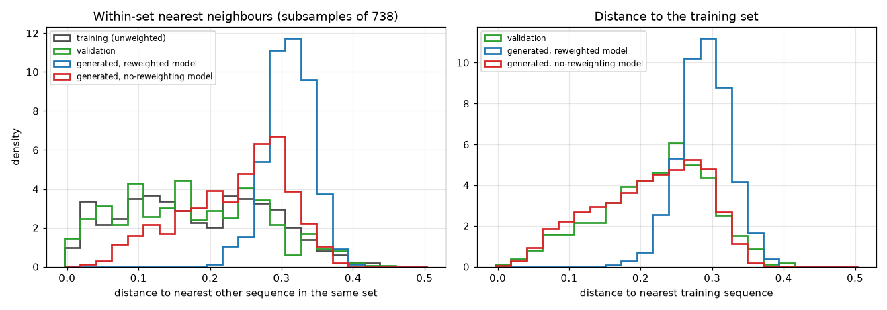

# Input and reweighting

## From file to training data

Every command that reads an alignment goes through the same loader:

1. **Parse** FASTA (plain or gzip) or Stockholm; sequences may span several lines.
2. **Detect or apply the alphabet.** Detection considers only the standard DNA, RNA and protein alphabets, in that order, after normalizing gap symbols.
3. **Drop invalid sequences**, those with symbols outside the alphabet.
4. **Remove exact duplicates**, keeping the first copy.
5. **Compute or read the weights**, and match supplied weights to the retained rows (a weight file may refer to the original or the retained alignment).

The counts of each step are printed and stored in the training log and in `training.json` (`input_report`). A validation alignment goes through the same steps separately and never contributes to the gradient. Explicit cleaning, such as removing insertions or gappy rows, is the job of [`preprocess`](../usage/preprocess.md), not of the loader.

## Why sequences are reweighted

Sequence databases are not a uniform sample of a family. Some subfamilies have been sequenced many times, and close homologues share residues because of common ancestry, not because of structural or functional constraints. Without correction, a large cluster of near-identical sequences would dominate the frequencies the model learns, and the couplings would partly encode phylogeny.

adabmDCA gives each sequence the weight \(w_m = 1/n_m\), where \(n_m\) is the number of sequences (itself included) with more than 80% identity to it. A sequence in a cluster of 20 near-copies counts as 1/20; an isolated sequence counts as 1. The sum of the weights is the **effective number of sequences** \(M_{\rm eff}\), a rough measure of how much independent information the alignment holds.

The ratio \(M_{\rm eff}/M\) says how redundant an alignment is. On the example families it ranges from 0.08 (LBD training set, 13,864 rows for an \(M_{\rm eff}\) of 1,149) to 0.64 (cm_russ). A small \(M_{\rm eff}\) relative to the number of parameters (\(L^2 q^2/2\), about 1.7·10⁷ for a 200-residue protein) is the main reason why DCA models need regularization, and why the held-out likelihood eventually decreases when training continues.

Options: `--clustering_seqid` changes the threshold, `--weights file` supplies weights (one number per line), `--no_reweighting` sets all weights to 1. Weighted frequencies are normalized by \(\sum_m w_m\), so multiplying all weights by a constant changes \(M_{\rm eff}\) but not the frequencies.

Reweighting also matters downstream: distances, PCA clusters and data-vs-samples comparisons use the weighted natural sequences, because the model is fitted to the weighted distribution.

### Reweighting and the redundancy of generated sequences

In every benchmark family, **generated sequences contain far fewer near-duplicates than natural alignments**: their nearest neighbours are farther apart than in the data. To see how much of this comes from reweighting, the RF00379 bmDCA model was trained twice with PTT and the validation stop, with and without `--no_reweighting`, and 2,000 sequences were sampled from each.

[{ width="960" }](../figures/benchmarks/rf00379_reweighting_distances.png)

*Left: distance from each sequence to its nearest other sequence in the same set, on subsamples of 738 sequences (the size of the validation set), since nearest-neighbour distances shrink with set size. Right: distance from each sequence to its nearest training sequence.*

| Set | Within-set nearest neighbour, median | Share with a neighbour closer than 0.1 |
| --- | --- | --- |
| Training sequences | 0.177 | 26% |
| Validation sequences | 0.169 | 28% |
| Training sequences, drawn in proportion to their weights | 0.258 | 3% |
| Generated, model trained with reweighting | 0.312 | 0% |
| Generated, model trained without reweighting | 0.248 | 4.6% |

- **Reweighting removes most near-duplicates from the samples.** The reweighted model generates none; the unweighted model generates 4.6%, close to the reweighted data (3%).
- **No model reproduces the phylogenetic signal of the data.** Even trained on unweighted sequences, the model generates 4.6% near-duplicates against 26% in the alignment. Natural sequences come in tight, nested clusters of close relatives, the trace of their shared evolutionary history. A Potts model, which describes the data through one- and two-site statistics only, cannot represent that hierarchical structure: it spreads its probability more evenly over the family.
- **Without reweighting, samples sit as close to the training set as held-out sequences do** (median distance to the nearest training sequence 0.221 vs 0.228, no identical sequence). With reweighting they sit farther (0.294). Each model fits the distribution it was trained on: the all-pair distances of its samples match that distribution, and each has the higher validation likelihood under its own weighting (uniform weights: −0.669 vs −0.676 per site; 80% weights: −0.706 vs −0.720).

The absence of near-duplicates in generated sequences is therefore expected and not a defect, but it is not a sign that the model generalizes beyond its data either. Keep it in mind when reading the [distance checks](diagnostics.md#distances-and-overfitting). This test used one family and one seed per model.

## Pseudocount

Rare residues and residue pairs have frequency zero in a finite alignment, which would require infinite parameters. The pseudocount \(\alpha\) mixes the data frequencies with a uniform distribution:

\[
f_i^\alpha(a) = (1-\alpha) f_i(a) + \frac{\alpha}{q}, \qquad f_{ij}^\alpha(a,b) = (1-\alpha) f_{ij}(a,b) + \frac{\alpha}{q^2}.
\]

The default \(\alpha = 1/M_{\rm eff}\) is small: it matters only for frequencies that would otherwise be zero or of order \(1/M_{\rm eff}\). Larger values (0.001–0.01) make training easier and the model smoother, at the price of expressiveness. For `edgeDCA` the pseudocount has a different role (it sets the step size, default 0.1), described in [Training](training.md#sparse-models).

## Held-out sets

A validation set has three uses:

- **Stopping.** With PTT, training stops when the held-out log-likelihood stops improving, which is close to its maximum (see [Training](training.md#when-training-stops)).
- **Generalization.** Training metrics always improve with training; held-out metrics reveal when the model starts fitting noise.
- **Overfitting checks on samples.** [Distance checks](diagnostics.md#distances-and-overfitting) compare generated sequences with held-out ones.

[`split-data`](../usage/split-data.md) builds the split by clustering, so that close homologues stay together. Because the held-out sequences then have no near-copy in the training set, held-out metrics are systematically lower than training metrics, more so on redundant families. On the benchmark families, the validation Pearson of a converged model ranged from 0.60 (cm_russ, 225 validation sequences) to 0.94 (β-lactamase, 32,665): the gap reflects the size and diversity of the held-out set as much as the model.
