# Sampling

Generating sequences from a Potts model means running Markov chains until they forget where they started, then reading their states. The hard part is knowing when that has happened. This page describes the local moves, the two sampling strategies and how each decides it is done, and how to read the plots `sample --plot` produces.

## Local moves

All strategies update one position at a time, sweeping through the sequence. Three update rules are available (`--sampler`, `--ptt-local-kernel`); all leave the model distribution unchanged and differ only in speed.

- **Gibbs** draws the new residue from its conditional probability given the rest of the sequence.
- **Metropolized Gibbs** (default) draws a residue *different from the current one* from the same conditional distribution, renormalized, and accepts it with probability \(\min\{1, (1-p_{\rm old})/(1-p_{\rm new})\}\). It changes the sequence more often than Gibbs, which may redraw the current residue.
- **Metropolis** proposes a uniformly random residue and accepts it with probability \(\min\{1, e^{-\Delta E}\}\). Cheap, but at conserved positions almost every proposal is rejected.

[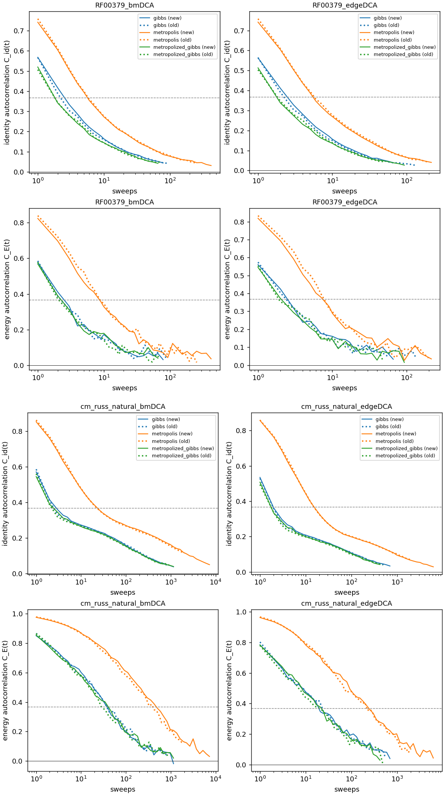{ width="720" }](../figures/benchmarks/kernels_decorrelation.png)

*Decorrelation of 2,000 chains started from equilibrium sequences, for an RNA (RF00379, q = 5) and a protein (cm_russ, q = 21) family, dense (bmDCA, left) and sparse (edgeDCA, right) models; RF00379 in the upper half, cm_russ in the lower half. In each half, the first row is the identity with the starting sequence, rescaled to go from 1 to 0, and the second row the correlation between initial and current energies. Gibbs (blue) and Metropolized Gibbs (green) overlap; Metropolis (orange) needs 2–3× more sweeps on the RNA and about 10× more on the protein. Dotted lines are the original PyTorch kernels, solid lines the optimized ones (Triton on GPU, Numba on CPU). They overlap as a function of the number of sweeps, so the two implementations produce the same dynamics; the optimized ones are 24–74× faster per sweep on GPU and 7–36× on CPU ([Benchmarks](benchmarks.md#sampling-kernels)). Energy is the slow observable: identity drops in a few sweeps, energy takes tens (RNA) to about a hundred (protein) sweeps.*

On a GPU, an independent sample (one energy correlation time) of the cm_russ model cost 54 ms with Gibbs, 70 ms with Metropolized Gibbs and 365 ms with Metropolis, for 2,000 chains. On the RNA family the three cost between 2.9 and 4.6 ms, so none was more than 1.6× costlier than the cheapest.

## Plain MCMC

`sample --strategy pcd` runs independent chains on the final model.

**Measuring the mixing time.** With a reference alignment (`-d`), it first starts chains from natural sequences and follows two quantities as a function of time \(t\):

- the mean sequence identity between each chain at time \(t\) and the **same chain at time \(t/2\)**;
- the mean identity between **two different chains** at time \(t\).

At first a chain resembles its own past more than it resembles another chain. When the two identities meet, within their statistical errors, the chains have forgotten their state at \(t/2\); that time is the mixing time \(t_{\rm mix}\).

**Generating.** It then starts `--ngen` chains from random sequences and runs them for `--nmix` × \(t_{\rm mix}\) sweeps (default 2). If \(t_{\rm mix}\) is not found within `--max_nsweeps`, the run stops at the budget and warns that sampling did not converge.

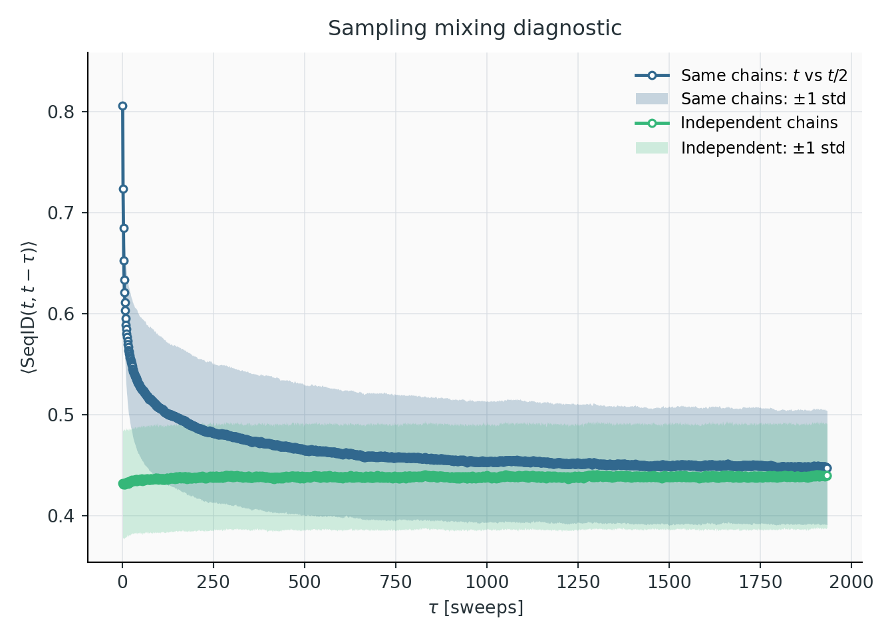{ width="560" }

*RF00023, PTT-trained bmDCA model. Identity between each chain at time \(t\) and the same chain at \(t/2\) (blue), and between independent chains (green), with one-standard-deviation bands; the horizontal axis is \(t/2\). The self-identity drops quickly in the first sweeps, then approaches the independent-chain level slowly. The curves meet at about 1,900 sweeps, which is \(t_{\rm mix}\). Generation then runs \(2\,t_{\rm mix}\) sweeps.*

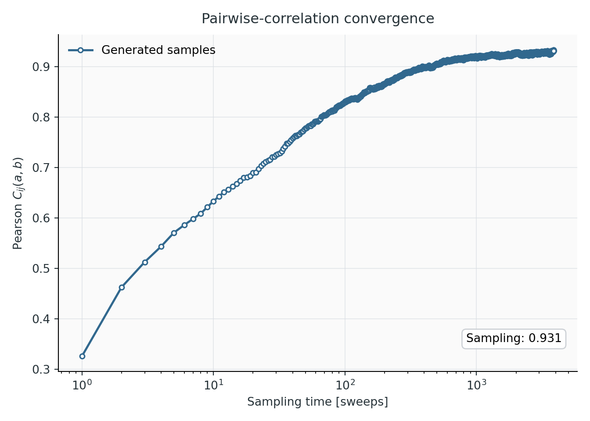{ width="560" }

*The Pearson of the samples with the data during that generation, from random sequences: it rises steadily and levels off at about 0.93 in the last few thousand sweeps, against 0.942 at the end of training. It should rise and settle at a plateau. A curve still rising at the end means the chains have not equilibrated. A curve that rises above its final level and then declines means the model was trained out of equilibrium: it reproduces the data during a transient of the sampler, not at its own equilibrium ([examples](benchmarks.md#out-of-equilibrium-training-seen-in-resampling)). A plateau well below the training value means the model differs from what training reported. A clean plateau near the training value is necessary but does not prove equilibrium: a multimodal model can plateau inside one mode.*

**The limitation.** The identity criterion measures how fast chains decorrelate *locally*. When the model has well-separated modes, chains started from random sequences fall into one of them and stay; their identity curves can still meet within one mode. On three of the six benchmark families, plain MCMC did not reach a mixing time within 10,000 sweeps, and on bkace the resulting samples missed a whole cluster:

[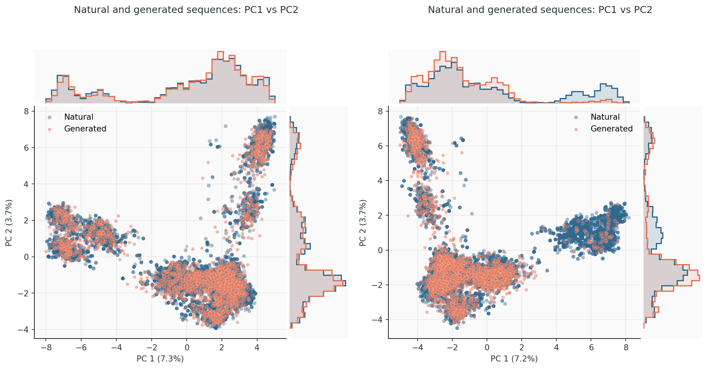{ width="980" }](../figures/benchmarks/bkace_pca_ptt_vs_mcmc.png)

*The same bkace model sampled with PTT (left) and with plain MCMC for 10,000 sweeps (right), projected on the first two principal components of the data (blue). PTT samples (orange) cover every cluster in the right proportions. MCMC samples almost entirely miss the cluster at PC1 ≈ 6 and over-populate the others. The MCMC Pearson with the data was 0.70, against 0.96 for PTT.*

## PTT sampling

`sample` (default) samples through the ladder saved during training. Unlike training, which keeps only the 2–3 most recent rungs active and feeds the lowest from a reservoir ([Training](training.md#keeping-the-ladder-usable)), sampling simulates **every model of the ladder at once**, from the exact profile to the final model. It needs no reservoir, and fresh configurations always enter from the exact profile.

### The sampling ladder

The ladder consists of the exact profile, every model flagged during training, and the final model: typically 7 to 15 models for bmDCA. It is fixed: sampling cannot insert models. Each rung gets `--ngen` chains, all initialized with exact profile draws. One **exchange round** attempts a swap between every pair of neighbouring populations, randomly permutes the populations, runs `--ptt-local-sweeps` (10) local sweeps per rung, and redraws rung 0 from the profile.

### Population renewal

Rung 0 is redrawn from scratch every round, and configurations elsewhere are never copied: swaps exchange them and local moves modify them in place. Every configuration therefore has a well-defined **birth round**, the round in which it was drawn at the bottom. Relative to a reference round:

- \(G(t)\), the **old fraction of the whole ladder**: configurations born before the reference. Old configurations are destroyed at the bottom and never created again, so \(G\) can only decrease.
- \(F(t)\), the **fresh fraction of the endpoint**: endpoint configurations born after the reference. \(1-F\), the old endpoint fraction, can go up again when old configurations climb back from lower rungs.

A phase ends when at most a fraction \(\varepsilon\) (`--ptt-renewal-tolerance`, 0.01) of one rung's worth of configurations is still old anywhere in the ladder, that is when \(G \le \varepsilon/n_{\rm models}\). Then even if all of them gathered at the endpoint, its old fraction could not exceed \(\varepsilon\). Only \(G\) decides, because it cannot go back up.

**Warmup** (always). The reference is the start. The phase ends when the initial populations, all exact draws of the profile, have been replaced. Every returned configuration then descends from fresh profile draws made during sampling. By default, the endpoint population at this point is returned.

**Stationary renewal** (`--ptt-stationary`). The reference becomes the end of the warmup, and sampling continues until the ladder is renewed again, checked at the end of blocks of a quarter of the warmup length (so that the stopping round does not depend on which configurations happen to be old). Every returned configuration was then born after the ladder had forgotten its initialization. It costs about twice as much.

Is one renewal enough? On RF00379 (three seeds) and on a 307-residue enzyme model with a slow ladder, samples taken after the warmup could not be told apart from samples taken after two, three or four renewals: same Pearson with the data, energy distributions within sampling noise (Kolmogorov–Smirnov distance 0.028 against 0.027 between later sets), principal-component distributions within bootstrap noise. The only hint was 1.5 percentage points fewer sequences in the smaller cluster of the enzyme model, 1.3 standard errors. Use `--ptt-stationary` when the samples must be certified, or when the trapped-configuration panel flags links; then compare the cluster shares of the two settings.

Extra batches, when more sequences are needed than chains per rung, are separated by one renewal time.

[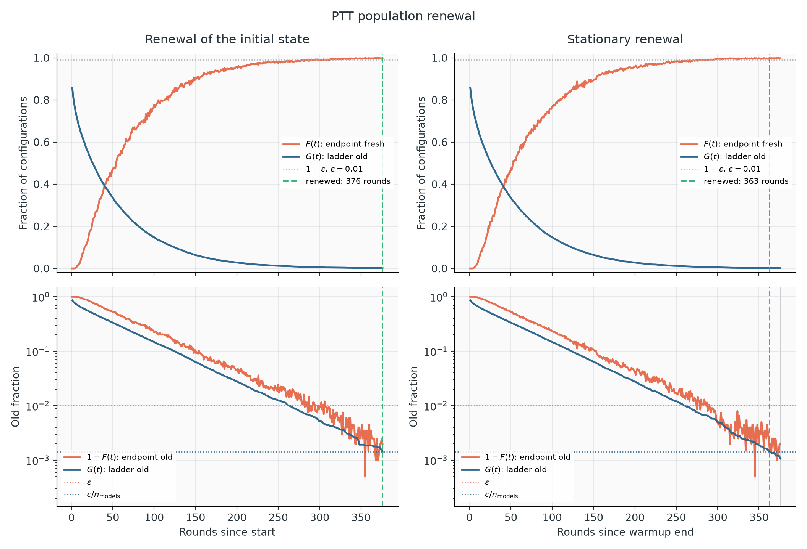{ width="880" }](../figures/rf00379/sampling/ptt_renewal.png)

*RF00379 with `--ptt-stationary`. Left: warmup; right: stationary phase. Top, linear scale: the fresh endpoint fraction \(F\) (orange) rises as the old ladder fraction \(G\) (blue) falls. Bottom, log scale: both old fractions decay nearly exponentially; the endpoint fraction \(1-F\) is noisy and crosses \(\varepsilon\) (red dotted) well before \(G\) reaches its threshold \(\varepsilon/n_{\rm models}\) (blue dotted), which decides the stop (green dashed, 376 and 363 rounds). The two phases look alike: the warmup had already brought the ladder to equilibrium.*

**What to look for.** A straight line on the log scale is healthy. A tail that flattens means some configurations leave much more slowly than the rest, typically a population trapped in a basin of an upper model. While sampling, a line is fitted to \(\log G\) every 10 rounds; the progress bar shows the predicted renewal round, and the command warns if \(G\) stops decreasing, if its decay time more than doubles, or if renewal is predicted beyond `--ptt-max-rounds`. The fit only informs; counting old configurations decides. Predictions are a little optimistic early on (about 15% on a 307-residue protein), because the slowest configurations leave last.

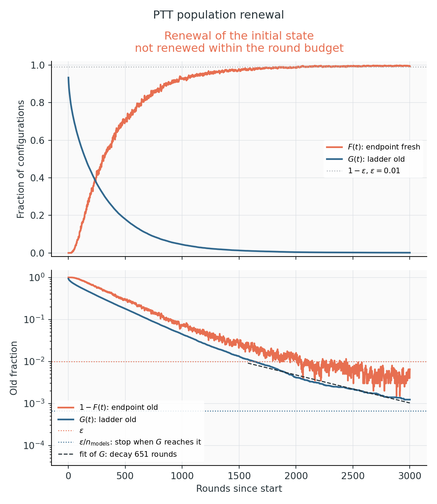{ width="520" }

*bkace, sampled with a 3,000-round budget. On the log scale (bottom), \(G\) is not a straight line: its decay time grows from about 340 rounds early on to 390, 470 and finally 850 rounds in the last 700 rounds. The slower configurations are the last to leave. The budget ran out with \(G = 1.2\cdot10^{-3}\), above the stopping threshold \(\varepsilon/n_{\rm models} = 6.7\cdot10^{-4}\) (dotted), so the run was marked as not converged. The endpoint itself was already 99.4% fresh.*

If the budget runs out, the samples are kept, marked as not converged, and `trapped_fraction` reports the old endpoint fraction; `old_fraction_by_model` shows where the old configurations are. A larger `--ptt-max-rounds` helps when \(G\) is still decreasing, even slowly, as here: at the final decay time, renewal needed about 500 more rounds. A plateau of \(G\) points to the training ladder, which sampling cannot fix: see [F7](diagnostics.md#f7-slow-or-incomplete-ptt-sampling).

Renewal is a diagnostic, not a proof: a mode of the final model that neither the ladder nor the local moves ever reach goes unnoticed.

`--ptt-mixing-method autocorrelation` replaces renewal with the integrated and exponential autocorrelation times of each configuration's position along the ladder, and spaces batches by twice the integrated time. It is the method of the original PTT implementation and is kept for comparison.

### Ladder health

After sampling, the final populations of every pair of neighbouring models are compared. All of this comes from the energy difference \(W = E_{k+1} - E_k\) evaluated on both populations, without extra sampling.

[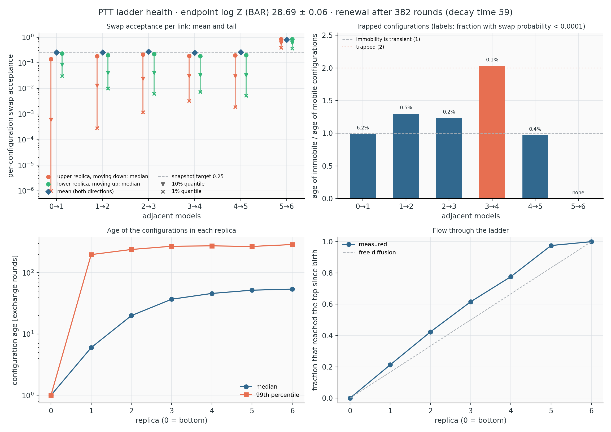{ width="960" }](../figures/rf00379/sampling/ptt_ladder_health.png)

*RF00379, seven models. The title gives the endpoint \(\log Z\) from Bennett's acceptance ratio and the renewal time.*

**Swap acceptance per link** (top left). The diamond is the mean acceptance, near 0.25 by construction of the training ladder, so it says little alone. The bars show the acceptance of individual configurations against random partners: median (dot), 10% (triangle) and 1% (cross) quantiles, for upper configurations moving down (orange) and lower ones moving up (green). A 1% quantile near the 10⁻⁶ floor, as on the 0→1 link here, means some configurations practically cannot cross; the next panel says whether that matters.

**Trapped configurations** (top right). For each link, the mean age of upper configurations whose downward swap probability is below 10⁻⁴, divided by the mean age of the others; the label is their fraction. A ratio near 1 means immobility is transient: local moves free those configurations as fast as the rest renew. On 0→1, 6.2% are immobile at the moment of measurement, but the ratio is 1. A ratio above 2 means they stay stuck, the signature of a slow mode. Here 3→4 just reaches 2, but carried by 0.1% of the configurations (two chains), it is within noise. On cm_russ, two links reached 2.1–3.6 with a few percent of the configurations, both for the final model and for a failing training state.

**Configuration ages** (bottom left). Median and 99th percentile of the rounds since birth, per rung. Ages grow up the ladder. An old tail that appears from one rung upward points at the link below it; compare the 99th percentile with the renewal time in the title.

**Flow** (bottom right). The fraction of configurations at each rung that have visited the top since birth. Free diffusion along the ladder gives the dashed diagonal. A curve above the diagonal near the top, as here, means configurations come back down more slowly than they climb. A sharp step between two rungs marks a bottleneck.

The free-energy differences of each link (forward, reverse and BAR, with bootstrap errors), the effective sample sizes of the reweighting and the Crooks slope are in `logs/ptt_ladder_health.log` and `sampling.json` → `ladder_health`. On the families studied they mostly reflected the snapshot spacing and were similar for easy and hard families, so they are not plotted.

## Comparing samples with the data

With a reference alignment, every sampling run compares the generated sequences with the (weighted) natural ones.

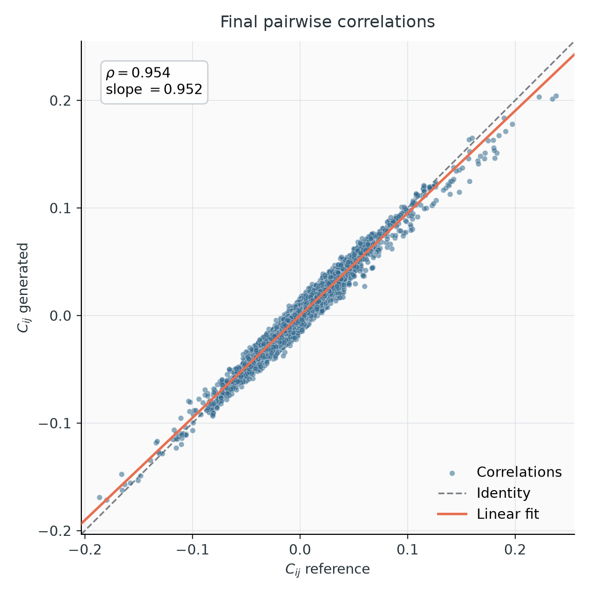{ width="480" }

**Connected correlations.** Each point is one entry \(C_{ij}(a,b)\), data against samples. Points on the diagonal, a Pearson near the training value and a slope near 1 mean the pair statistics are reproduced. Finite samples scatter the points and lower the Pearson, so compare at equal sample size (2,000 sequences for the default 2,000 training chains). On healthy runs the sampled Pearson is 0.003–0.007 below the training value.

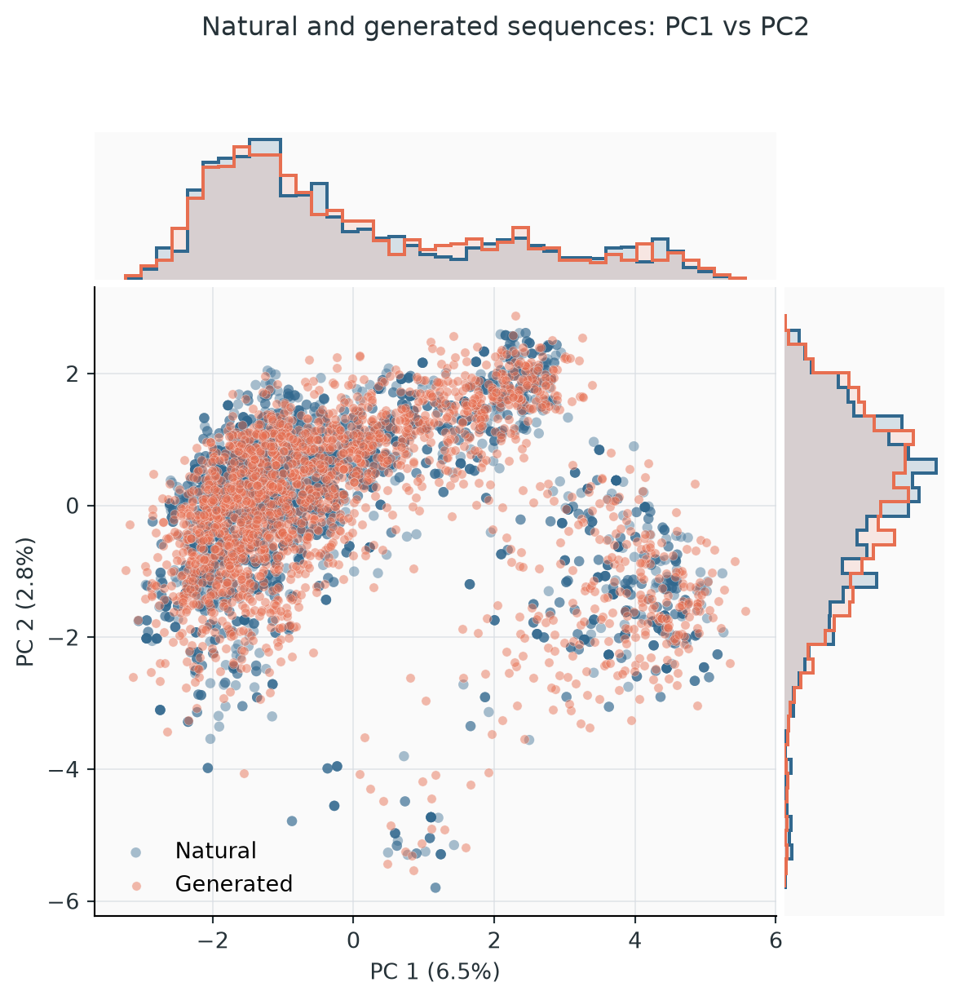{ width="490" }

**Principal components.** Natural and generated sequences projected on the first principal components of the natural data, with marginal histograms. The generated cloud should cover every natural cluster with similar density. A missing or over-populated cluster is more informative than any aggregate number. PCA emphasizes directions of large variance and can miss small subfamilies.

[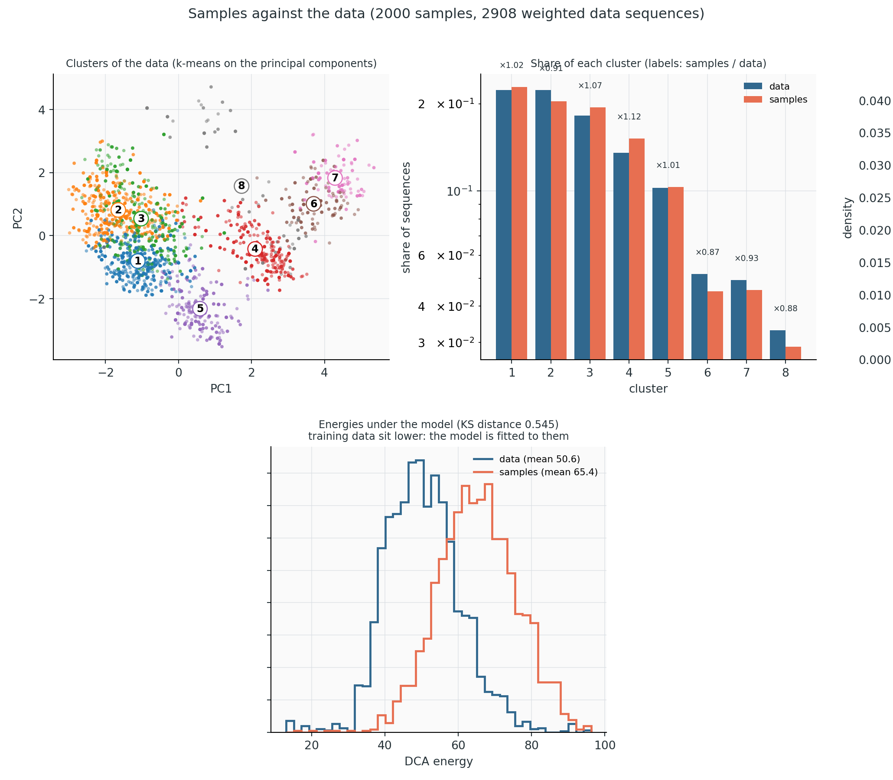{ width="860" }](../figures/rf00379/data_vs_samples.png)

**Data vs samples** (`data_vs_samples.png`, RF00379, 2,000 PTT samples).

- *Top left, clusters of the data.* The weighted natural sequences are grouped by k-means on their first four principal components, here into 8 clusters, and drawn on the first two. The clusters are defined on the data only. Each generated sequence is then assigned to its nearest cluster centre.
- *Top right, share of each cluster.* For every cluster, the fraction of the (weighted) data and of the samples in it, on a log scale; the label is the ratio samples/data. Here all ratios lie between ×0.87 and ×1.12. Ratios between ×0.8 and ×1.25 were typical of well-sampled models. A cluster far from ×1, or empty in the samples, is a region the model or its sampling mis-weights. Because every sample goes to its nearest centre, adjacent clusters can trade samples across a shared boundary, so read pairs of neighbouring clusters together.
- *Bottom, energies under the model.* The distributions of the model energy of the training sequences and of the samples. Training sequences sit lower (mean 50.6 against 65.4 here; about 50 units lower on cm_russ) because the model was fitted to them, so the shift is expected and only the shapes are informative. A sample distribution with a second peak, or much broader than the data, points to a mode the data do not have.

The cluster numbers are recomputed for every run and do not correspond between plots.

**Distances** (`distances.png`) test for memorization of the training set; they are described in [Diagnose a run](diagnostics.md#distances-and-overfitting).

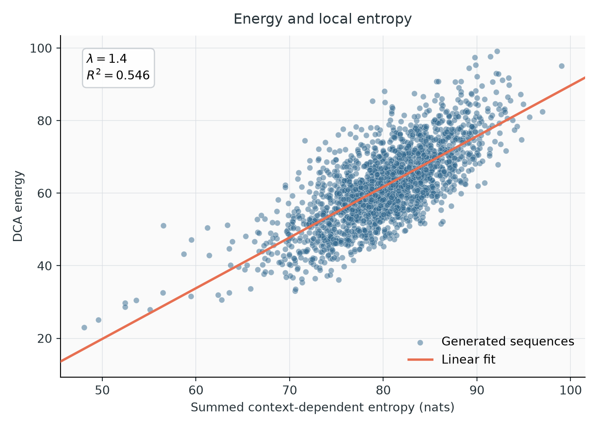{ width="560" }

**Energy vs context-dependent entropy.** Each generated sequence's energy against its summed context-dependent entropy, with a linear fit. The slope (about 1.4 here, with \(R^2 \approx 0.55\)) is the coefficient to use for the local free energy in [`energies --local-lambda`](../usage/energies.md#context-dependent-entropy-and-local-free-energy).

## Steered sampling

From Python, sampling can be biased toward sequences with a chosen property, with importance weights that correct averages back to the unbiased model. With PTT, steered rungs of increasing strength are added above the final model, so mixing is still checked by renewal from the profile. See [Python workflows](../usage/python.md#steered-sampling) and the [mathematics](../quantities/derived.md#steering-and-importance-weights).
