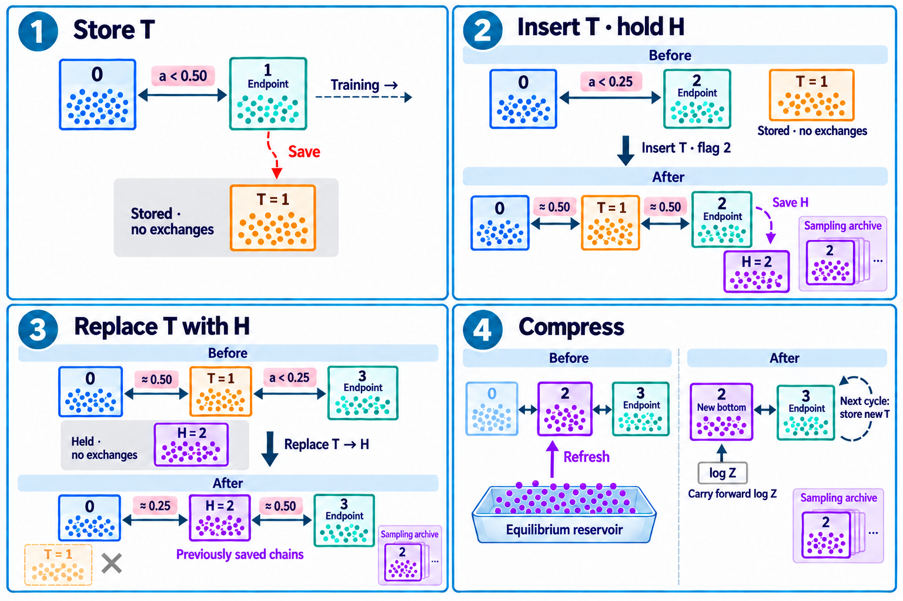
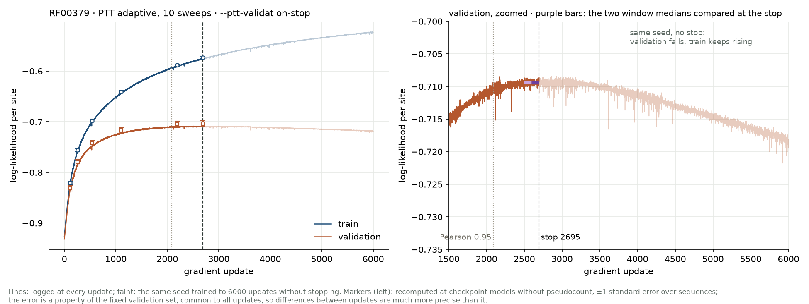
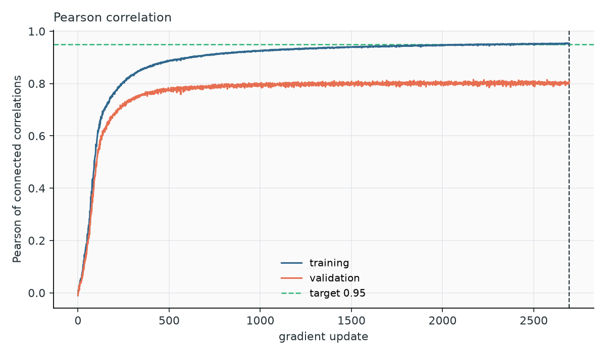
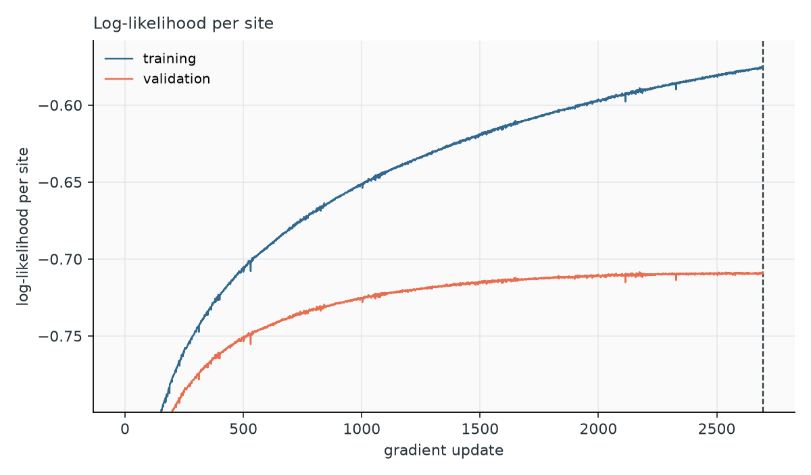
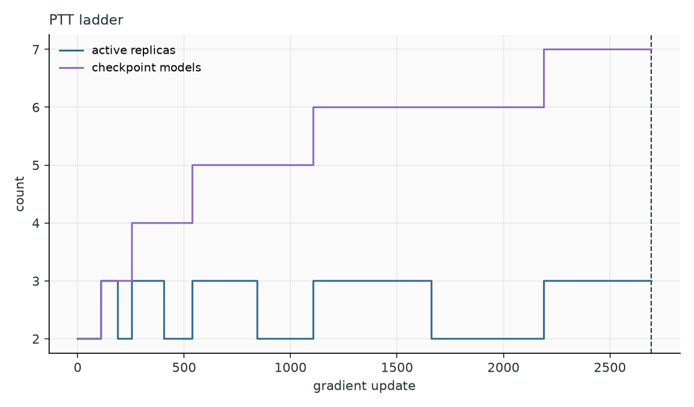
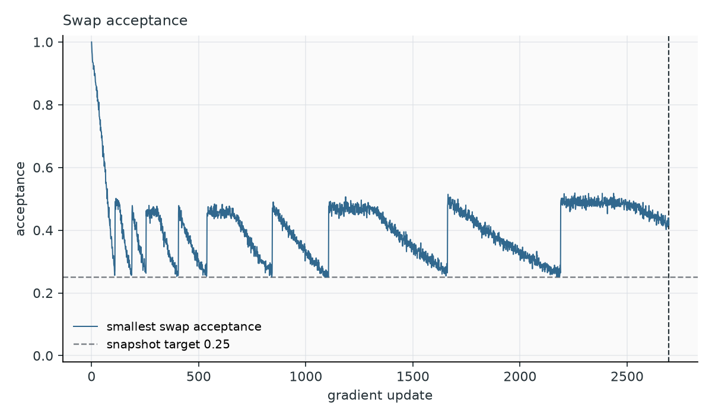
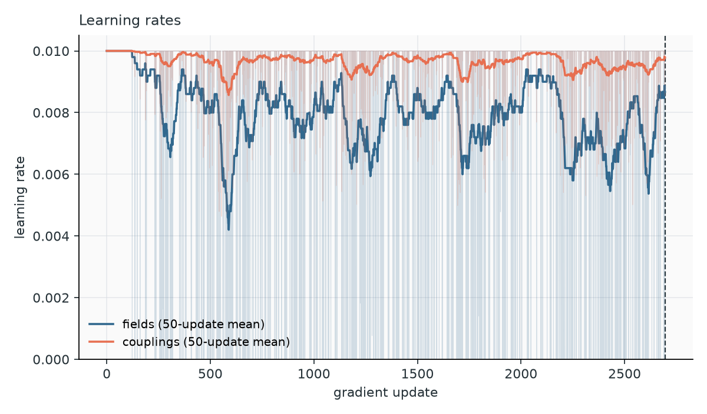
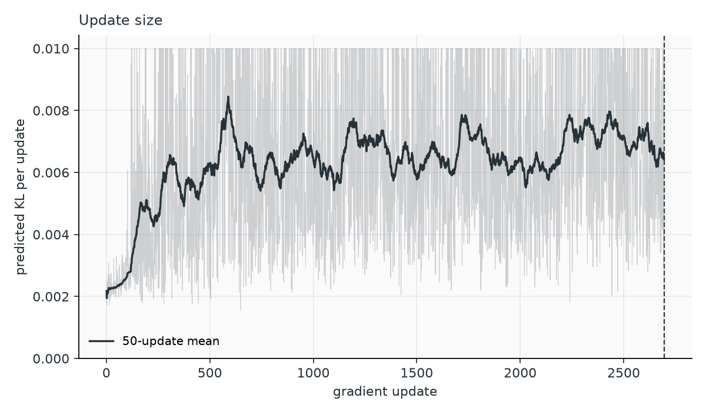
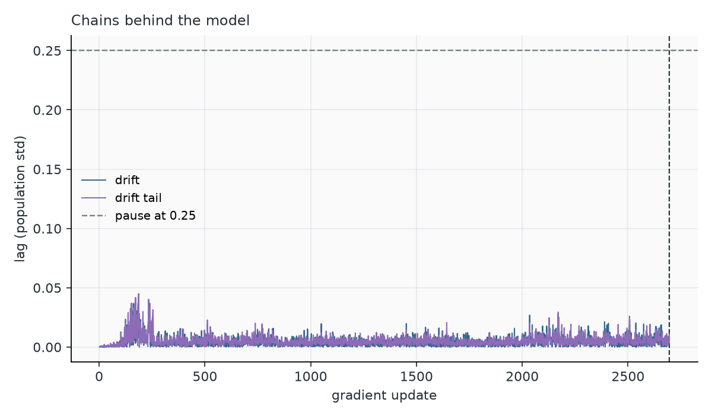
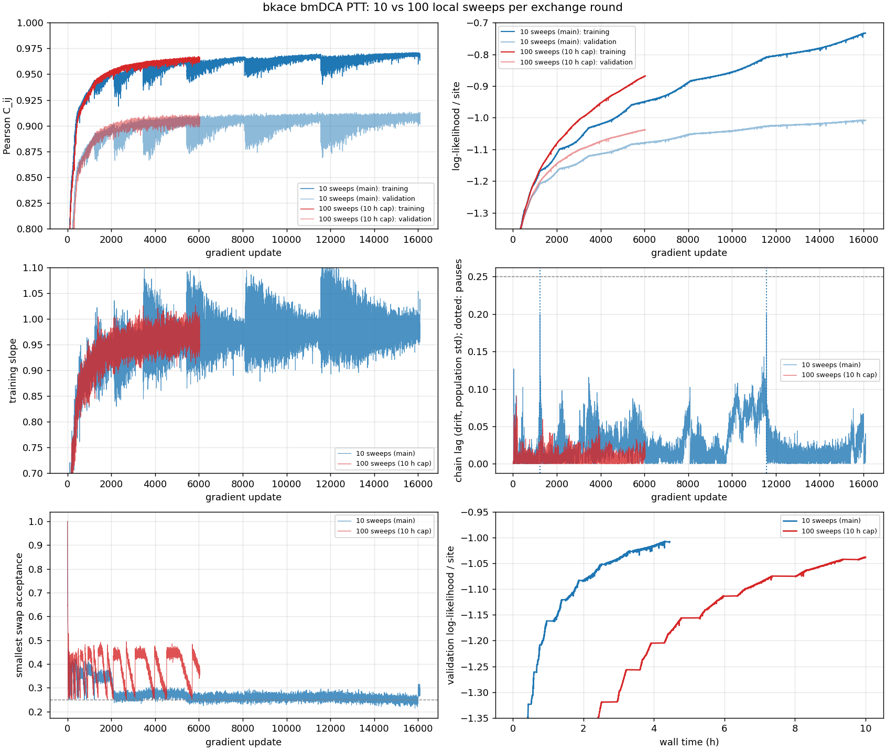

# Training

## The learning rule

Maximum-likelihood training of a Potts model has a simple gradient: for every field and coupling, the difference between the frequency measured on the data and the frequency predicted by the model,

\[
\Delta h_i(a) \propto f_i(a) - p_i(a), \qquad \Delta J_{ij}(a,b) \propto f_{ij}(a,b) - p_{ij}(a,b).
\]

When a residue pair is more frequent in the data than in the model, its coupling increases, and vice versa. At convergence the model reproduces every one- and two-site frequency. The data frequencies \(f\) are computed once from the weighted alignment. The model frequencies \(p\) change after every update and are estimated by Monte Carlo: they are averages over a population of chains sampling the current model. The two training strategies differ in how they keep that population representative.

## PCD: persistent chains

Persistent contrastive divergence keeps one population of 2,000 chains across the whole training. Each update runs `--nsweeps` sweeps (default 10) of every chain on the current model, computes \(p\) from the chains, and updates the parameters with learning rate `--lr`. Because the model changes little between updates, the chains stay close to equilibrium as long as they decorrelate faster than the model moves.

PCD is fast and works well on families without strong cluster structure. Its weakness is silent: when the model develops separated modes, chains stop moving between them, the estimate of \(p\) is biased toward the modes the chains happen to occupy, and the reported Pearson, computed from the same chains, still looks good. In the [benchmarks](benchmarks.md), PCD models of three large protein families could not even be checked, because plain MCMC sampling of the finished models did not mix within 10,000 sweeps.

The Pearson correlation rises quickly at first (about 0.9 after a few hundred updates) and then slowly, approximately as a power law. `--target 0.9` gives a usable coarse model in a fraction of the time.

## PTT: a ladder along the training trajectory

Parallel Trajectory Tempering ([Béreux et al., 2026](https://arxiv.org/abs/2607.27077)) replaces the single population with a **ladder of models** taken from the training trajectory itself:

```text
 rung 0                rung 1          rung 2              endpoint
 profile model ─────── snapshot ────── snapshot ────────── current model
 (fields only,         (update 110)    (update 260)        (update t)
  sampled exactly)
   ▲  fresh draws         ◄──── neighbouring populations exchange configurations ────►
```

Rung 0 is the independent-site profile, a model with fields only that matches the single-site frequencies of the data. Its sequences can be drawn exactly and its normalization is known. The other rungs are snapshots of the model saved during training, and the top rung is the current model. All rungs run at the same temperature; it is the parameters that change along the ladder.

Each rung holds its own population of chains. Neighbouring populations regularly attempt to **swap** configurations, with a Metropolis acceptance that keeps every rung at equilibrium for its own model. Configurations born at the bottom as exact draws can thus climb to the endpoint, carrying independent information that local moves alone would take very long to produce. Because neighbouring models are close, a swap is accepted often; because the snapshots were saved when the model was changing, they cover the path along which modes appeared.

The ladder gives two further benefits:

- **Normalization.** Each pair of neighbouring models overlaps, so their free-energy difference can be measured from the swap statistics. Starting from the exactly known \(\log Z\) of the profile and adding these differences gives \(\log Z\) of the current model. PTT therefore reports normalized log-likelihoods and the entropy during training, which PCD cannot.
- **A sampling ladder for later.** The snapshots are kept in `ptt.h5`, and [PTT sampling](sampling.md#ptt-sampling) reuses them to generate sequences from the final model.

Training and sampling use the ladder differently. Simulating every saved model at every update would make training slower and slower as the ladder grows. Training therefore keeps only the 2–3 most recent rungs active, and feeds the lowest of them from a **reservoir** of equilibrium configurations collected earlier, instead of from the profile ([below](#keeping-the-ladder-usable)). Sampling, done once on the finished model, simulates the whole ladder from the exact profile to the final model.

### One update

1. **Evolve the ladder.** Run \(\max(1, \lfloor\sqrt{R}\rfloor)\) exchange rounds for \(R\) active rungs. One round attempts a swap between every pair of neighbouring populations, randomly permutes each population, runs `--nsweeps` local sweeps in every rung, and refreshes rung 0 with exact profile draws (or from the reservoir, below).
2. **Estimate the gradient** from the endpoint population.
3. **Choose the step** with the adaptive optimizer, or pause if the chains lag behind the model (below).
4. **Submit the new model** as the endpoint. If the swap acceptance with the rung below has dropped, update the ladder.
5. **Record** statistics, likelihoods, ladder state and events; save a checkpoint every `--checkpoint-interval` updates.

### Keeping the ladder usable

As training proceeds, the endpoint moves away from the rung below it, and their swap acceptance \(a\) falls. PTT adds rungs so that the models kept in the ladder end up about `--ptt-target-acceptance` (0.25) apart. You only know where the next rung belongs once the endpoint has reached it. A rung also needs its own population of chains, and the only equilibrated population of the endpoint's model is the endpoint's own chains. Copying them into the ladder would put two identical sets of configurations side by side. PTT therefore works with copies saved earlier, which have decorrelated from the endpoint chains by the time they are used:

[{ width="900" }](../figures/ptt_ladder_illustration.png)

1. **Store T.** When \(a\) drops below 0.5 (twice the target), the endpoint's model and chains are saved as a **temporary snapshot** T. T is not in the ladder yet: the endpoint keeps exchanging with the rung below.
2. **Insert T, hold H.** When \(a\) drops below 0.25, T is inserted between that rung and the endpoint, and the ladder runs 10 extra exchange rounds (`--ptt-equilibration-rounds`). T sits roughly halfway, so both of its links start near 0.5 and the endpoint again has a close neighbour. The endpoint keeps training. A copy of its current model is **flagged** for the sampling archive and kept, with its chains, as the **held snapshot** H.
3. **Replace T with H.** When the endpoint's acceptance with T drops below 0.25, T is discarded and H takes its place, with the chains saved in step 2. H is about 0.25 from the rung below it and about 0.5 from the endpoint. A new T is stored almost immediately, and the cycle starts again.
4. **Compress.** Every rung costs as much as the endpoint. When the active ladder exceeds `--ptt-max-replicas` (2) after a replacement, PTT collects a **reservoir** of equilibrium configurations (10 × the chain count) at the rung that becomes the new bottom. It then drops the rungs below it and refreshes the new bottom from the reservoir instead of the profile. The free-energy differences of the dropped links are added to the anchor, so \(\log Z\) remains available.

The temporary snapshots are scaffolding. The flagged models form the sampling ladder, spaced at about 0.25 acceptance, which is why the mean acceptance of every link in the [ladder-health plot](sampling.md#ladder-health) sits near 0.25. The active ladder stays at 2–3 rungs. In the log, one cycle reads:

```text
»    75  snapshot stored, swap acceptance 0.48
»   110  checkpoint flagged, swap acceptance 0.25
»   110  snapshot inserted, swap acceptance 0.25
»   189  snapshot replaced, swap acceptance 0.24
»   189  mixing check converged: renewal warmup 36 rounds, stationary renewal 47 rounds, trapped endpoint fraction 0.000
»   189  reservoir refreshed: 20000 samples, 2 active replicas, warmup 35 rounds, spacing 70 rounds, min batch fresh 0.999
»   190  snapshot stored, swap acceptance 0.47
```

### Mixing checks and recovery

High swap acceptance between neighbours does not guarantee that configurations travel along the whole ladder. PTT therefore runs explicit **mixing checks**: at initialization, before every reservoir collection, and whenever the swap acceptance of some link falls below `--ptt-min-acceptance` (0.1). The default check, *population renewal*, labels every configuration with the round it entered the ladder and waits until all configurations present at the start have been replaced by newer ones, twice, within `--ptt-mixing-max-rounds` (20,000) rounds. Reservoir batches are spaced by the measured renewal time, so they are independent.

When a check fails, PTT **recovers**: it searches the saved checkpoints backward for the newest one whose mixing check passes, restores it, halves both learning rates (for edgeDCA, it raises the pseudocount instead), and continues. After `--ptt-max-recoveries` (3) recoveries, training stops with an error that names the likely cause:

- configurations that practically cannot swap toward the bottom (a narrow basin the model has learned; the remedy is to restart with more local sweeps);
- a link whose acceptance is below the target (rungs too far apart; a smaller learning rate or a higher target acceptance);
- every link above the target (local relaxation too slow; more local sweeps).

[Diagnose a run](diagnostics.md) explains each case and what to change.

### The adaptive optimizer

The default PTT optimizer, `adaptive`, does two things a fixed learning rate cannot.

**Trust-region steps.** Fields and couplings get separate learning rates, both at most `--lr`. Before every update the optimizer estimates, from the endpoint chains, how much the proposed step would change the model distribution, measured as a KL divergence. It accounts for the correlation between field and coupling directions, which is strong (95% on cm_russ). It then picks the rates that maximize the predicted likelihood gain while keeping the predicted KL below `--ptt-trust-radius` (0.01). At the default `--lr 0.01` the constraint rarely binds: both rates stay at 0.01 and the predicted KL is around 10⁻³. With a larger `--lr`, it binds at every step, and the optimizer spends the whole budget on the couplings, leaving the field rate at its floor.

**Pausing when the chains fall behind.** A small step in parameter space can still be too fast for the chains. When a new mode forms (a subfamily the model starts to represent), the time the chains need to populate it grows. If updates continue, the gradient is computed from chains that under-represent the mode, asks for more of it, and the model overshoots. The optimizer measures this **lag** before every update. Each endpoint configuration carries a memory of the energy changes recent updates imposed on it; if the chains had caught up, a configuration's current state would no longer correlate with those pushes. The remaining correlation, in population standard deviations, is the lag. It is measured along the *drift*, the energy difference between the endpoint and the rung below, which is the direction the model has moved, and along the tails of the drift distribution, where a forming mode first shows.

When the lag exceeds `--ptt-lag-tolerance` (0.25), training **pauses**: a snapshot is inserted just below the endpoint, giving its chains a close neighbour to exchange with, and the ladder runs at fixed parameters until the lag halves (at most `--ptt-lag-pause-rounds`, 100 rounds). Another pause can start only after 10 updates. In the log:

```text
»   198  pause: drift tail lag 0.28 → 0.07, inserted a snapshot, 0 extra rounds
```

!!! example "Why the pause matters: a 307-residue enzyme family"
    Around update 200, the model of a catalytic protein family (L = 307) formed a new mode holding 7.1% of the weighted data. With fixed trust-region steps and no pause, the chains fell behind for about 50 updates. Training finished at Pearson 0.95 with 7.4% of its chains in the mode, apparently matching the data. Yet the finished model, sampled independently, put **at least 16%** of its sequences there, and its equilibrium Pearson was 0.896.

    The same run with the lag pause was identical until update 198, where the drift lag crossed the threshold. One snapshot insertion brought it from 0.28 to 0.07, with no extra rounds needed. The finished model put **8.7%** of its sequences in the mode (data: 7.1%), with an equilibrium Pearson of 0.947. The cost was 33% more updates but only 7% more sampling work.

    | | Without pause | With pause |
    | --- | --- | --- |
    | Updates to Pearson 0.95 | 1,234 | 1,637 |
    | Local sweeps (all work) | 2.08 M | 2.23 M |
    | Largest lag | 0.54 | 0.28 |
    | Mode in training chains | 7.35% | 7.05% |
    | Mode at equilibrium | ≥ 16.2% | 8.7% |
    | Equilibrium Pearson | 0.896 | 0.947 |

    On β-lactamase and bkace the chains kept up at both 10 and 100 sweeps; the pause never fired and the trajectories were identical to those without it. When the chains keep up, the lag measurement costs one energy evaluation per update and changes nothing.

The lag is a linear-response estimate. For a mode that fills by rare transitions, such as a deep, narrow basin, it can underestimate how far the chains are from equilibrium, and the pause may come too late. That case is handled by more local sweeps ([F1](diagnostics.md#f1-a-narrow-basin-traps-configurations)). `--ptt-optimizer sgd` uses fixed steps without trust region or pause; it is meant for comparisons only.

## Sparse models

A fully connected model has \(\binom{L}{2} q^2\) couplings, most of them small. Sparse models keep only the couplings the data require.

**eaDCA** (element activation) starts from the profile, with no couplings, and alternates two moves: activating the fraction `--factivate` (0.001) of the inactive coupling entries for which data and model disagree most, measured by a per-entry KL divergence between the data and model pair frequencies; then `--gsteps` (10) gradient updates on the enlarged graph. With PTT, each gradient update is a PTT update and activation happens together with the first update of a block, so a rejected update leaves the graph unchanged. With `--ptt-activation adaptive`, `--factivate` becomes a maximum: only candidates whose frequency difference exceeds three standard errors of the data and chain estimates are eligible, and only as many as fit half of the trust region on their first update. When no candidate is significant, training stops as `graph_converged`.

**edDCA** (element decimation, PCD only) goes the other way. Starting from a converged bmDCA model (supplied with `-p` and `-c`, or trained first), it repeatedly removes the fraction `--drate` (0.01) of the remaining couplings whose removal changes the model least, then re-fits the rest, until the density reaches `--density` (0.02).

**edgeDCA** (edge activation) works on whole position pairs. At each step it picks the pair with the largest KL divergence between data and model pair distributions, including pairs already active, and sets its couplings directly, \(J_{ij}(a,b) \mathrel{+}= \log f^\alpha_{ij}(a,b) - \log p^\alpha_{ij}(a,b)\), where both frequencies are smoothed with the pseudocount \(\alpha\). There is no learning rate: the pseudocount sets the step size. With \(\alpha\) close to 1 both frequencies approach the uniform value and the step becomes small. The fixed point is still \(f = p\) for the unsmoothed frequencies, so the pseudocount does not limit what the model can represent. The default is 0.1, and values up to 0.95 help on difficult datasets. With PTT's adaptive optimizer, the pseudocount of each step is raised as needed to keep its predicted KL within the trust region.

The [benchmarks](benchmarks.md#bmdca-vs-edgedca) found bmDCA preferable to edgeDCA in accuracy, robustness and cost on all six families. Use sparse models when sparsity itself is the goal.

## When training stops

**Pearson target.** Without a validation set, training stops when the Pearson correlation between the connected correlations \(C_{ij}(a,b) = f_{ij}(a,b) - f_i(a)f_j(b)\) of data and chains reaches `--target` (0.95). Connected correlations are used rather than raw pair frequencies because the latter are dominated by the single-site frequencies, which are easy to fit.

**Validation plateau** (PTT, default when `-v` is given). After every update, training compares the median validation log-likelihood of the last 100 updates with the median of the 100 before. It stops as soon as the recent median is lower (`--ptt-validation-min-gain`, default 0), that is, when the held-out curve no longer rises. Medians make the rule insensitive to the spikes of the \(\log Z\) estimate at ladder changes; windows of 100 updates average over its slower fluctuations.

[{ width="1040" }](../figures/benchmarks/rf00379_validation_stop.png)

*RF00379, 10 sweeps. Left: training and validation log-likelihood per site; the faint continuation is the same seed trained to 6,000 updates without stopping. Right: the validation curve, zoomed. The validation stop (dashed, update 2,695) fires near the maximum of the held-out likelihood, which then declines while the training likelihood keeps rising. The Pearson target (dotted) would have stopped earlier.*

On RF00379 (three seeds), the rule stopped within 40 updates of the maximum of the smoothed validation curve, at most 4·10⁻⁵ nats per site below it. Stopping at Pearson 0.95 instead gave about 10⁻³ less, and training on to 6,000 updates about 9·10⁻³ less. The stop also adapts to the family: on the benchmark families it ended at training Pearson values between 0.918 and 0.968.

**Budgets.** `--max-gradient-steps`, `--max-structure-steps` and `--nepochs` stop training before convergence, with a stop reason that says so.

## Reading the training plots

The figures produced by `plot-training-log` for an RF00379 PTT run. Read them together: a rising fit curve alone does not show that the chains kept up.

{ width="600" }

**Pearson.** The training curve rises toward the target (dashed). The validation curve is lower and levels off earlier; the gap is set by the size and diversity of the held-out set, not only by the model. Sudden drops after a recovery are rolled-back updates. Regular dips that coincide with reservoir refreshes are normal at 10 sweeps (see the bkace figure below).

{ width="600" }

**Log-likelihood per site.** Higher is better. The training likelihood keeps rising; the validation likelihood flattens and eventually declines, which is where the validation stop acts. Single-update spikes of up to 0.01 at ladder changes are noise of the \(\log Z\) estimate. A validation curve that falls over hundreds of updates means overfitting. Absolute likelihoods depend on the family (alphabet size, conservation, gap content), so compare curves within one family only.

{ width="600" }

**Ladder.** The active-replica count oscillates between 2 and 3 as snapshots are inserted and the ladder compressed; it does not grow. The count of flagged models, which form the sampling ladder, rises in steps. A long sampling ladder makes PTT sampling slower: bmDCA runs on the benchmark families saved 7–15 models, edgeDCA runs up to 47.

{ width="600" }

**Smallest swap acceptance.** A saw-tooth between about 0.25 (snapshot insertion) and 0.5–0.9 (just after it) is healthy. Long stretches pinned at 0.25 mean the ladder is inserting snapshots as fast as it can, typical at 10 sweeps on large families. Values below 0.1 trigger a mixing check.

{ width="600" }

**Learning rates.** At the default `--lr` both rates stay at 0.01 most of the time. Occasional updates with the field rate at its floor (10⁻¹⁴) are normal: the trust region then spends its budget on the couplings. A field rate at the floor for most updates means `--lr` is too large. Halved rates after a recovery persist.

{ width="600" }

**Predicted KL.** How far each update moves the model, according to the optimizer. A median around 10⁻³ is typical; values pinned at the trust radius (0.01) mean the steps are capped.

{ width="600" }

**Lag.** Below about 0.05 most of the time on healthy runs. Peaks approaching the dashed tolerance (0.25) trigger a pause; a run with repeated pauses deserves a look at [F2](diagnostics.md#f2-the-chains-fall-behind-a-forming-mode).

### A larger family: what 10 and 100 sweeps look like

[{ width="1040" }](../figures/benchmarks/bkace_nsweeps.png)

*bkace (L = 272), bmDCA PTT with 10 (blue) and 100 (red) local sweeps per round; the 100-sweep run stopped at a 10-hour cap. At 10 sweeps, the Pearson and slope curves dip sharply at every reservoir refresh (updates 2,108, 3,448, 5,427, 8,084, 11,565), the smallest acceptance is pinned at the 0.25 target from update ~2,000, and the lag reaches 0.2 twice, triggering two pauses. At 100 sweeps the optimization is smoother: half the update-to-update noise, a regular acceptance saw-tooth, lag below 0.06 and no pause, and a higher likelihood at equal update count. But each update costs 6× more, so 10 sweeps reaches a given validation likelihood sooner (bottom right).*

## Outputs and logs

### `history.csv`

One row per update. Columns present depend on the strategy and model.

| Column | Meaning |
| --- | --- |
| `step` | Update number (gradient step; graph step for PCD sparse models) |
| `sweeps` | Cumulative local sweeps per chain, **all work included** (mixing checks, reservoir, recovery, pauses) |
| `time_s` | Training time; excludes mixing checks and reservoir collection, so a large gap with wall time points at those phases |
| `pearson`, `slope` | Fit of the connected correlations, training data vs endpoint chains |
| `pearson_val`, `slope_val` | The same against the validation data |
| `ll_train`, `ll_val` | Log-likelihood per site (PTT) |
| `entropy`, `logz` | Model entropy and \(\log Z\), nats per sequence (PTT, forward bridge) |
| `replicas`, `models` | Active rungs; flagged models kept for sampling (PTT) |
| `acceptance_min` | Smallest swap acceptance between neighbouring rungs (PTT) |
| `lr_bias`, `lr_coupling` | Field and coupling learning rates (PTT) |
| `kl` | Predicted KL of the update (adaptive optimizer) |
| `lag_drift`, `lag_drift_tail` | Lag of the chains along the drift and its tails (adaptive optimizer) |
| `gradient_steps`, `stage`, `density` | Sparse models: parameter updates, current phase, fraction of active couplings |
| `structure_steps`, `steps_on_graph`, `activated_entries`, `active_entries` | eaDCA with PTT: activation blocks and couplings |
| `edge_i`, `edge_j`, `edge_new`, `edge_pseudocount` | edgeDCA with PTT: the selected pair, whether it was new, the pseudocount used |

### `events.jsonl` and the `»` lines of the log

| Event | Meaning |
| --- | --- |
| `checkpoint_saved` | Parameters, chains and archive written |
| `ptt_snapshot_stored`, `ptt_snapshot_inserted`, `ptt_snapshot_replaced`, `ptt_checkpoint_flagged` | Ladder maintenance |
| `ptt_reservoir_refreshed` | Ladder compressed; reports warmup and spacing rounds. Values in the tens of rounds are healthy; steadily growing values (38 → 51 → 144) warn of trapping |
| `ptt_mixing` | A mixing check, with its outcome; failed checks list the immobile configurations per rung |
| `ptt_lag_pause` | A pause: lag before and after, ladder action, extra rounds |
| `ptt_recovery`, `ptt_learning_rate` | A rollback and the new learning rates |
| `ptt_activation` | eaDCA: couplings requested and activated, density before and after |
| `ptt_validation_plateau` | The validation stop |

### Checkpoints and the archive

Every `--checkpoint-interval` updates (default 500), and at every flagged model, `params.dat.gz`, `chains.fasta` and `ptt.h5` are rewritten. The archive is written to a temporary file, validated and moved into place, so an interrupted run always leaves a consistent archive; it is the authoritative state. It also stores recovery points, so it grows with the length of the run.
