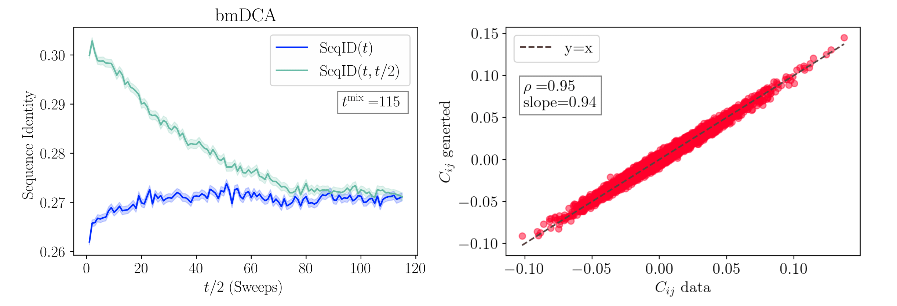

# Applications

!!! info
    We report in the [Script arguments](script_arguments.md#script_arguments) section the list of all the possible input arguments of each routine. The same information can be shown from the command line using:
    
    ```
    adabmDCA <routine_name> -h
    ```

## <span id="sampling">🧬 Generate Sequences</span>

Once a model is trained, it can be used to generate new sequences with:

```bash
adabmDCA sample -p <path_params> -d <fasta_file> -o <output_folder> --ngen <num_gen>
```

- `<output_folder>`: directory to save the output.
- `<num_gen>`: number of sequences to generate.

The tool first estimates the **mixing time** `t_mix` by simulating chains from the MSA. It then initializes `num_gen` Markov chains and runs `nmix * t_mix` sweeps (default `nmix = 2`) to ensure thermalization. 

📦 Output Files:

- A FASTA file of generated sequences
- A log file for reproducing the mixing time surves ([Fig. 3](#fig-mixing-time)-left)
- A log file tracking the Pearson $C_{ij}$ score as a function of the sampling time 

### Convergence Criterion

To ensure proper sampling, sequence identity is used to track mixing:

- $\mathrm{SeqID}(t)$ = identity between pairs of independent samples
- $\mathrm{SeqID}(t, t/2)$ = identity between the same chain at different times

Denoting $\pmb{a}_i(t)$ the i-th sequence of the MSA at sampling time $t$, these are computed as:

$$
    \mathrm{SeqID}(t) = \frac{1}{N} \sum_{i=1}^{N} \mathrm{SeqID}(\pmb{a}_i(t), \pmb{a}_{\sigma(i)}(t)) \qquad \mathrm{SeqID}(t, t/2) = \frac{1}{N} \sum_{i=1}^{N} \mathrm{SeqID}(\pmb{a}_i(t), \pmb{a}_i(t/2))
$$

where $\sigma(i)$ is a random permutation of the index $i$ and

$$
    \mathrm{SeqID}(\pmb{a}, \pmb{b}) = \frac{1}{L}\sum_{i=1}^L \delta_{a_i, b_i} \in [0, 1]
$$


Convergence is assumed when $\mathrm{SeqID}(t) \cong \mathrm{SeqID}(t, t/2)$.


<span id="fig-mixing-time">__Figure 3__: _Analysis of a bmDCA model. **Left**: measuring the mixing time of the model using $10^4$ chains. The curves represent the average overlap among randomly initialized samples (dark blue) and the one among the same sequences between times $t$ and $t/2$ (light blue). Shaded areas represent the error of the mean. When the two curves merge, we can assume that the chains at time $t$ forgot the memory of the chains at time $t/2$. This point gives us an estimate of the model's mixing time, $t^{\mathrm{mix}}$.  Notice that the times start from 1, so the starting conditions are not shown. **Right**: Scatter plot of the entries of the Covariance matrix of the data versus that of the generated samples._</span>

---

## <span id="contact-prediction">🔗 Contact Prediction</span>

One of the principal applications of the DCA models has been that of predicting a tertiary structure of a protein or RNA domain. In particular, with each pair of sites $i$ and $j$ in the MSA, `adabmDCA 2.0` computes a contact score that quantifies how likely the two associated positions in the chains are in contact in the three-dimensional structure.
Formally, it corresponds to the average-product corrected (APC) Frobenius norms of the coupling matrices [Ekeberg et al., [2013](https://doi.org/10.1103/PhysRevE.87.012707)], i.e.

$$
F_{i,j}^{\rm APC} = F_{i,j} - \frac{\sum_{k} F_{i,k} \sum_{k} F_{k,j}}{\sum_{kl} F_{k,l}}, \quad F_{i,j} = \sqrt{\sum_{a,b \neq '-'} J_{i,j}\left(a, b \right)^{2}}
$$

To compute contact scores:

```bash
adabmDCA contacts -p <file_params> -o <output_folder>
```
Zero-sum gauge and gap symbols are handled internally.

📦 Output Files:

- `<label>_frobenius.txt` with scores for each pair.

---

## <span id="scoring">📉 Sequence Scoring</span>

To score sequences using the DCA energy with a trained model:

```bash
adabmDCA energies -d <fasta_file> -p <file_params> -o <output_folder>
```

📦 Output Files:

- FASTA file where each sequence is annotated with its statistical energy. Lower energies correspond to more likely (or better fitting) sequences under the model.

---

## <span id="DMS">🧪 Single Mutant Library</span>

To simulate a mutational scan around a wild-type sequence:

```bash
adabmDCA DMS -d <WT> -p <file_params> -o <output_folder>
```

📦 Output Files:

- FASTA file where each sequence represents a single-point mutant, named by mutation and $\Delta E$ (change in energy). Example:

```
>G27A | DCAscore: -0.6
```

Negative $\Delta E$ suggests improved fitness.

---

## <span id="reintegration">🔁 Reintegrated DCA Model from Experiments</span>

As described in [Calvanese et al., [2025](https://doi.org/10.48550/arXiv.2504.01593)], it is possible to train a DCA model informed with experimental feedback in order to improve the model's ability of generating functional sequences:

```bash
adabmDCA reintegrate -d <nat_msa> -o <output_folder> --reint <reint_msa> --adj <adj_vector> --lambda_ <lambda_value> --alphabet <protein/rna>
```

**Parameters:**

- `nat_msa`: MSA of natural sequences
- `reint_msa`: MSA of tested sequences
- `adj_vector`: a text file containing experimental results for the reintegration dataset. Each line of the file should contain `+1` or `-1`, where the i-th line corresponds to:
    - `1` if the i-th sequence of the `reint_msa` passes the experimental test;
    - `-1` if the i-th sequence does not pass the experimental test;
- `lambda_`: reintegration strength (default: 1)
- `alphabet`: `protein` or `rna`, sequence type

💡 __Tip__: It is possible to use continuous values from -1 to 1 for the `adj_vector`, depending on the performance of the sequence in the experiment. Additionally, the `lambda_` parameter can be fine-tuned to adjust the reintegration strength. If unsure, a good starting point is to use `lambda_` = 1 and ±1 values for the `adj_vector`.

---

## <span id="profmark">🧠 Train/Test Split for Homologous Sequences</span>

When dealing with a family of __homologous sequences__, splitting data into training and test sets has to be done carefully. There are two main reasons for this:

1. Since homology introduces __correlations between sequences__, a simple random split would yield a test set that closely reproduces the training set on any statistical test,
2. Because some regions of the sequence space are sampled more than others, the test set might contain densely populated clusters of sequences that would __bias__ any type of assessment.

To overcome these issues, we propose a simplified __GPU-accelerated version__ of the `cobalt` algorithm introduced in [Petti et al., [2022](https://doi.org/10.1371/journal.pcbi.1009492)]. The algorithm proceeds in two steps:

1. A first __train/test split__ is done, such that no sequence in the test set has more than `t1` fractional sequences identity with any sequences in the training set;
2. The __test set is pruned__ until any two sequences in it have fractional sequence identity that does not exceeds the value `t2`.

Typical usage:

```bash
adabmDCA profmark -t1 <t1> -t2 <t2> --bestof <n_trials> <output_prefix> <input_msa>
```

**Required:**

- `t1`: max train/test identity
- `t2`: max identity within test set
- `n_trials`: number of trials to find best split
- `output_prefix`: generates `<output_prefix>.train` and `<output_prefix>.test` files
- `input_msa`: input MSA in FASTA format

**Optional:**

- `-t3`: max train/train identity
- `--maxtrain`, `--maxtest`: size limits for train and test sets
- `--alphabet`: sequence type (`protein`, `rna`, `dna`)
- `--seed`: random seed (default 42)
- `--device`: computation device (default `cuda`)
