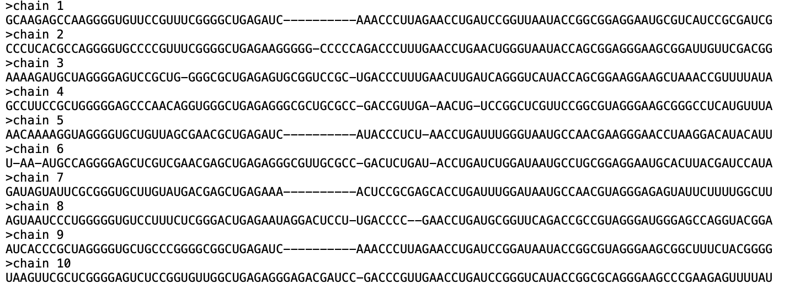

## Input Data & Preprocessing

### Input Format

`adabmDCA 2.0` takes a **multiple sequence alignment (MSA)** containing aligned
protein, RNA, or DNA sequences. The Python implementation accepts FASTA,
gzip-compressed FASTA, and Stockholm input; its preprocessing command writes
canonical FASTA output (see [Fig. 1](#fig-fasta)).

The CLI detects the three standard alphabets automatically and also accepts an
explicit **custom alphabet** when the MSA contains nonstandard symbols.

| Type     | Alphabet Symbols |
|----------|------------------|
| protein  | `-, A, C, D, E, F, G, H, I, K, L, M, N, P, Q, R, S, T, V, W, Y` |
| RNA      | `-, A, C, G, U` |
| DNA      | `-, A, C, G, T` |

*Note: line breaks within sequences are supported.*

Automatic detection selects the smallest compatible standard alphabet in the
order DNA, RNA, protein. Data containing only symbols shared by DNA and RNA,
such as `A`, `C`, and `G`, is therefore classified as DNA. Use
`--alphabet rna` to resolve such an alignment as RNA, or pass the exact token
string for a custom alphabet.

___Figure 1__: Example of a FASTA file containing an MSA._

---

### Preprocessing Steps

The following steps are applied to every input MSA:

1. **Remove sequences** with invalid symbols.
2. **Remove** duplicate sequences.
3. **Reweight** sequences to correct for phylogenetic and sampling bias (optional).
4. **Compute empirical statistics** using a pseudocount.

For explicit Stockholm conversion, insertion removal, gap filtering, and JSON
processing reports, see the [alignment utilities](alignment_preprocessing.md).

---

### Sequence Reweighting

To downweight overrepresented or phylogenetically related sequences, `adabmDCA` uses a clustering threshold (default: **80% identity**). The **weight** for sequence $\mathbf{a}^{(m)}$ is:

$$
w^{(m)} = \frac{1}{N^{(m)}}
$$

where $N^{(m)}$ is the number of sequences that have sequence identity with $\mathbf{a}^{(m)}$ above the clustering threshold.

- Set the threshold with `--clustering_seqid <value>`
- Disable with `--no_reweighting`

---

### Pseudocount Regularization

A small **pseudocount** $\alpha$ is added to frequency estimates to prevent issues with rare or unobserved symbols:

- One-site frequency:   
  $f_i(a) = (1 - \alpha) f^{\mathrm{data}}_i(a) + \frac{\alpha}{q}$

- Two-site frequency:  
  $f_{ij}(a, b) = (1 - \alpha) f^{\mathrm{data}}_{ij}(a, b) + \frac{\alpha}{q^2}$

If not set via `--pseudocount`, the default is `0.1` for `edgeDCA`; for all other training routines it is:
$$
\alpha = \frac{1}{M_{\text{eff}}}, \quad \text{with} \quad M_{\text{eff}} = \sum_{m=1}^M w^{(m)}
$$
being the _effective number of sequences._

For `edgeDCA`, this pseudocount also acts as an effective learning rate: values closer to `1` produce smaller updates, and some datasets can use values up to `0.95`. The explicit `--lr` parameter is ignored by `edgeDCA`.

---
