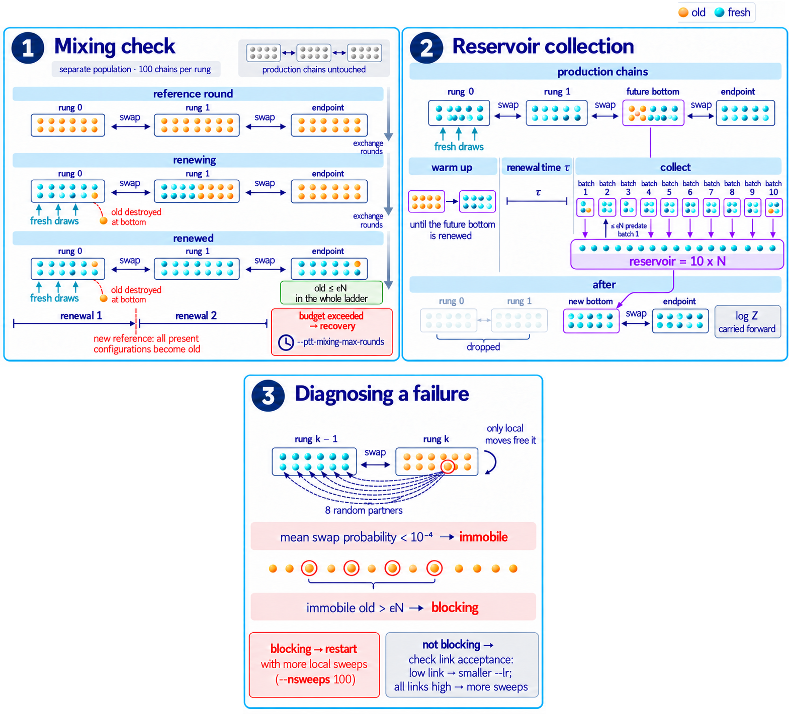

# Sampling quantities

Definitions behind [Sampling](../algorithms/sampling.md) and [Diagnose a run](../algorithms/diagnostics.md).

## Local moves

At a position \(i\) with current state \(a\), let \(\pi_b = p(x_i = b \mid x_{-i})\) be the conditional probabilities of the model (or of the rung's model, in PTT).

- **Gibbs**: draw the new state \(b\) with probability \(\pi_b\).
- **Metropolis**: propose \(b\) uniformly among the \(q\) states and accept with probability \(\min\{1, \pi_b/\pi_a\} = \min\{1, e^{-\Delta E}\}\).
- **Metropolized Gibbs** (Liu, 1996): propose \(b \neq a\) with probability \(\pi_b/(1-\pi_a)\) and accept with probability

\[
A(a\to b) = \min\!\left\{1, \frac{1-\pi_a}{1-\pi_b}\right\}.
\]

All three satisfy detailed balance with respect to the model. Metropolized Gibbs never proposes the current state, so it changes the sequence more often than Gibbs. A **sweep** is one update attempt at every position of every chain.

## Swap acceptance

Rung \(k\) samples \(p_k(x) = e^{-E_k(x)}/Z_k\). For neighbouring rungs write \(W_k(x) = E_{k+1}(x) - E_k(x)\). Exchanging configuration \(y\) of rung \(k\) with configuration \(x\) of rung \(k+1\) is accepted with probability

\[
A(x, y) = \min\big\{1, \exp[W_k(x) - W_k(y)]\big\},
\]

which keeps both rungs at equilibrium. `acceptance_min` in the training history is the smallest observed acceptance fraction over the neighbouring pairs. The snapshot rules use the top link: store a temporary snapshot below \(2a_*\), insert it below \(a_*\) (`--ptt-target-acceptance`, \(a_* = 0.25\)). An observed acceptance below `--ptt-min-acceptance` (0.1) on any link requests a mixing check.

`replicas` counts the active rungs; `models` counts the models flagged for the sampling ladder.

## Population renewal

Every configuration has a **birth round** \(b\): the round in which it was drawn exactly at the bottom of the ladder (in a compressed training ladder, the round it was emitted by the reservoir). Swaps and permutations move configurations with their birth labels; nothing copies a configuration. For a reference round \(r_0\), \(R\) rungs and \(N\) chains per rung,

\[
G(t) = \frac{\#\{\text{configurations in the ladder with } b < r_0\}}{RN},
\qquad
F(t) = \frac{\#\{\text{endpoint configurations with } b \ge r_0\}}{N}.
\]

`ladder_old` is \(G\) and `endpoint_fresh` is \(F\). Old configurations are destroyed at the bottom and never created, so \(G\) is non-increasing; \(1-F\) is not. Renewal is reached at the first round where

\[
RN\,G(t) \le \varepsilon N \quad\Longleftrightarrow\quad G(t) \le \frac{\varepsilon}{R},
\]

with \(\varepsilon\) = `--ptt-renewal-tolerance` (0.01). At that point the endpoint's old fraction is at most \(\varepsilon\) and can never exceed it again.

**Sampling phases.** The warmup uses \(r_0 = 0\) and lasts \(W\) rounds (`warmup_rounds`). With `--ptt-stationary`, a second phase uses \(r_0 = W\). Its renewal is checked only at block ends, every \(\lceil W/4\rceil\) rounds (`block_rounds`), and sampling stops at the first block end after renewal. Stopping at the exact round of renewal would let the population choose when sampling stops: the stop would fall right after the last old configuration happened to be redrawn at the bottom, so the returned population would be one selected by that event. Block ends are fixed in advance and do not depend on which configurations are old, so the returned population is not selected by the stopping rule. The price is at most a quarter of the warmup in extra rounds. `renewal_rounds` is the round at which the second renewal happened. Further batches are separated by one renewal time (`spacing_rounds`). `trapped_fraction` is \(1-F\) at the end; `old_fraction_by_model` gives the old fraction per rung. All are in `logs/mix.log` and `sampling.json`.

**Decay forecast.** Every 10 rounds, a line is fitted to \(\log G\) over the more recent half of the phase, starting from the first round with \(G < 0.5\). Its slope gives the decay time (`warmup_decay_rounds`, `stationary_decay_rounds`), and its crossing with \(\varepsilon/R\) the predicted renewal. The forecast drives the progress display and the warnings; it never decides the stop.

**Training checks.** During training, renewal is used in three ways, shown in the figure.

[{ width="900" }](../figures/training_checks_scheme_2col.png)

1. **Mixing check.** It runs on a separate population of `--ptt-mixing-chains` (100) chains per rung; the production chains are not touched. It passes when the ladder is renewed twice in a row: after the first renewal, every configuration present becomes old again and must be replaced once more. If this does not happen within `--ptt-mixing-max-rounds`, the check fails and training [recovers](../algorithms/training.md#mixing-checks-and-recovery).
2. **Reservoir collection.** It works on the production chains. The ladder first runs until the rung that will become the new bottom is renewed (warm-up), then measures that rung's renewal time \(\tau\). Its population is then copied into the reservoir in batches spaced so that at most \(\varepsilon N\) configurations of a batch predate the previous one, until the reservoir holds \(10N\) configurations. The lower rungs keep supplying fresh configurations throughout. Only at the end are they dropped, and the new bottom is fed from the reservoir, with \(\log Z\) carried forward.
3. **Failure diagnosis.** When a check or a collection fails, every old configuration of rung \(k\) is tested against 8 random partners in rung \(k-1\). If its mean swap probability is below \(10^{-4}\), it is **immobile**: only local moves can free it. If the immobile old configurations alone exceed the tolerance \(\varepsilon N\), they are **blocking**, and the error message recommends restarting with more local sweeps. Otherwise it reports the acceptance of each link: a link below the target calls for a smaller `--lr`, while links all above it call for more sweeps.

## Replica-index autocorrelation

The alternative `--ptt-mixing-method autocorrelation` follows the rung index \(r_t\) of each tagged configuration. With the uniform mean \((R-1)/2\) subtracted,

\[
C(t) = \frac{\langle (r_s - \bar r)(r_{s+t} - \bar r)\rangle}{\langle (r_s - \bar r)^2\rangle},
\qquad
\tau_{\rm int} = \frac12 + \sum_{t=1}^{T} C(t),
\]

with the window \(T\) chosen self-consistently (\(T \ge 6\,\tau_{\rm int}\)), and \(\tau_{\rm exp}\) from an exponential fit \(A e^{-t/\tau_{\rm exp}}\) to the tail of \(C\). A check passes when the trajectory is at least `--ptt-mixing-window-factor` (20) times \(\max(\tau_{\rm int}, \tau_{\rm exp})\) long. Generation batches are separated by \(2\lfloor\tau_{\rm int}\rfloor\) rounds. Both times are in exchange rounds.

## Plain-MCMC mixing time

Chains started from (resampled) reference sequences are run, and at each even time \(t\) the package compares the fractional identity between each chain and itself at \(t/2\),

\[
I_{t,t/2} = \frac1N\sum_{n}\mathrm{id}\big(x_n(t), x_n(t/2)\big),
\]

with the identity between distinct chains at time \(t\), \(I_t = \frac1N\sum_n \mathrm{id}(x_n(t), x_{\sigma(n)}(t))\) for a random permutation \(\sigma\) without fixed points, where \(\mathrm{id}(x,y) = \frac1L\sum_i \mathbf 1[x_i = y_i]\). The mixing time is the first \(t/2\) at which

\[
\frac{|I_{t,t/2} - I_t|}{\sqrt{\sigma_{t,t/2}^2 + \sigma_t^2}} < 0.1 ,
\]

where \(\sigma\) are the standard deviations of the identities over chains. Generation then runs fresh random chains for `--nmix` (2) mixing times. The criterion detects loss of memory of the starting point within the region the chains explore; it cannot detect a mode they never reach.

## Ladder health

For each neighbouring pair \((k, k+1)\), with \(W = E_{k+1} - E_k\) evaluated on both final populations and \(\Delta F = -\log(Z_{k+1}/Z_k)\):

- **Free-energy differences**: forward \(\widehat{\Delta F}_{\rm fwd} = -\log\langle e^{-W}\rangle_k\), reverse \(\widehat{\Delta F}_{\rm rev} = \log\langle e^{W}\rangle_{k+1}\), and Bennett's acceptance ratio `dF_bar` ([definition](derived.md#ptt-ladder)), each with a bootstrap error. `hysteresis` is forward minus reverse; beyond the errors it signals poor overlap.
- **Effective sample size** of one reweighting step, for weights \(u_n\): \((\sum u_n)^2 / \sum u_n^2\), divided by the number of samples (`ess_forward` with \(u = e^{-W}\) on rung \(k\), `ess_reverse` with \(u = e^{W}\) on rung \(k+1\)). Near 1: even weights; near 0: a few configurations dominate. `top1_share_*` is the weight carried by the heaviest 1%. Finite samples overestimate the ESS when overlap is poor, because they miss the extreme tail.
- **Crooks slope**: at equilibrium, the histograms of \(W\) in the two rungs satisfy \(\log[h_{k+1}(W)/h_k(W)] = \Delta F - W\). The slope fitted on quantile bins populated by both should be \(-1\); a deviation means the overlapping parts of the populations are not mutually consistent.
- **Mobility**: for each upper configuration, its swap probability averaged over all lower partners (downward mobility), and conversely. Quantiles of the mobilities are plotted (`acceptance_down_q50/q10/q01`, `acceptance_up_*`), and configurations with mobility below \(10^{-4}\) are **immobile** (`immobile_down_fraction`, `immobile_up_fraction`). `mean_acceptance` is the average mobility.
- **Ages**: a configuration born in round \(b\) has age \(t - b\) at round \(t\). `immobile_mean_age` / `mobile_mean_age` is the ratio plotted in the trapped-configurations panel; about 1 means immobility is transient, above 2 that immobile configurations stay stuck. Per rung, `age_median`, `age_q99` and the **flow**, the fraction of configurations that have visited the top rung since birth, are in `logs/ptt_replicas.log`.

These are heuristics, not calibrated tests: the threshold of 2 on the age ratio, in particular, is noisy when only a few configurations are immobile.

Only the mobility, age and flow measures are plotted (`ptt_ladder_health.png`). The free-energy differences, effective sample sizes and Crooks slopes are written to `logs/ptt_ladder_health.log` and `sampling.json` but not plotted. On the families studied they mostly reflected the spacing of the snapshots and took similar values on runs that worked and runs that failed, so they did not help to detect failures.

## Distances

The fractional Hamming distance between aligned sequences is \(d(x,y) = \frac1L\sum_i \mathbf 1[x_i \neq y_i]\), and the nearest-neighbour distance of \(x\) to a set \(T\) is \(d(x,T) = \min_{y\in T} d(x,y)\), excluding \(x\) itself when \(x \in T\). `distances.png` histograms all-pair and nearest-neighbour distances; natural sequences carry their weights, and at most `--nmeasure` sequences per set are drawn without replacement. Medians, quantiles and the fraction of generated sequences identical to a training sequence are in `sampling.json` → `distance_comparison.summary`.
