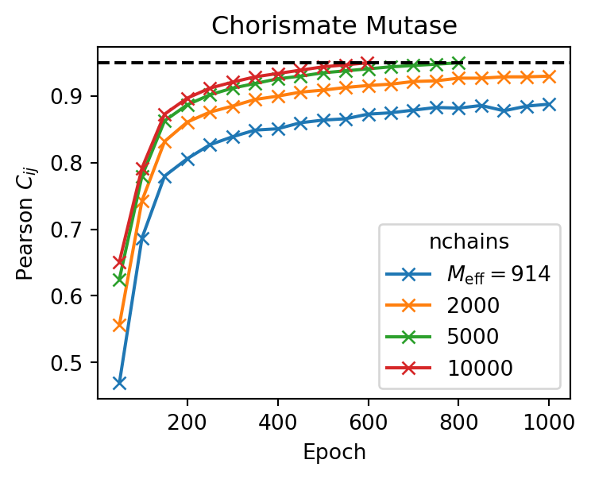

## ⚙️ Training

All `adabmDCA` implementations (Python, Julia, C++) provide a unified command-line interface. Training is performed using the command:

```bash
adabmDCA train -m <model> -d <fasta_file> -o <output_folder> -l <label>
```

Where:

- `-m <model>`: Type of model to train. Choose from:
    - `bmDCA`: Fully-connected Boltzmann Machine (default)
    - `eaDCA`: Sparse model with progressively activated couplings
    - `edDCA`: Sparse model obtained by decimating an existing `bmDCA` model
- `-d <fasta_file>`: Path to the input MSA in FASTA format
- `-o <output_folder>`: Output directory for storing results
- `-l <label>`: Optional label prefix for output files

!!! info
    All options are listed in [Script arguments](script_arguments.md#script_arguments). The same information can be shown from the command line using:
    
    ```
    adabmDCA train -h
    ```

Training proceeds until the Pearson correlation coefficient between the model and empirical two-point statistics reaches a target threshold (default: `--target 0.95`).

---

### 📦 Output Files

By default, the following files are generated during training (overwritten every 50 epochs):

- `<label>_params.dat`: Model parameters.
    - Lines starting with `J` encode pairwise couplings: position1, position2, symbol1, symbol2
    - Lines starting with `h` encode single-site biases: position, symbol
    - Inactive couplings (i.e. value 0) are not saved

- `<label>_chains.fasta`: Final state of Markov chains used during sampling

- `<label>_adabmDCA.log`: Log file recording training progress

---

### ♻️ Restart from a Checkpoint

To resume an interrupted training, provide saved parameters and chains:

```bash
adabmDCA train [...] -p <file_params> -c <file_chains>
```

This initializes the model and chains from previously saved states.

---

### ⚖️ Sequence Weights

You can provide precomputed [importance weights](preprocessing.md#computing-the-importance-weights) via:

```bash
-w <weights_file>
```

Otherwise, weights are computed automatically using sequence identity clustering and saved to:

```
<output_folder>/<label>_weights.dat
```

Use `--clustering_seqid` to control the sequence identity threshold, or `--no_reweighting` to disable reweighting.

---

### 🔠 Alphabet Specification

By default, the alphabet is set to `protein`. To specify others:

```bash
--alphabet rna
--alphabet dna
```

You can also define a **custom alphabet**:

```bash
--alphabet ABCD-
```

Just ensure the symbols match exactly with those in your MSA. Custom alphabets allow for specialized tokens or reordering.

---

## 🧠 Training Algorithms

### <span id="bmdca">🧩 `bmDCA`: Fully Connected Model</span>
This is the default training mode, where all possible pairwise couplings are learned.

---

### <span id="eadca">🌱 `eaDCA`: Progressive Coupling Activation</span>

This routine learns a sparse DCA model by gradually activating couplings.

Use:
```bash
adabmDCA train -m eaDCA [...]
```

Key hyperparameters:

- `--factivate <float>`: Fraction of inactive couplings activated per iteration (default: `0.001`)
- `--gsteps <int>`: Number of parameter updates per fixed coupling graph (default: `10`)
- `--nsweeps <int>`: MC sweeps per parameter update. Since only part of the model changes at each step, a smaller value (e.g. `5`) is usually sufficient.

---

### <span id="eddca">✂️ `edDCA`: Decimation for Sparsity</span>

This routine builds a sparse model by pruning the least informative couplings from a `bmDCA` model.

Two modes are available:

#### 1. **From Pretrained Model**
```bash
adabmDCA train -m edDCA -d <fasta_file> -p <file_params> -c <file_chains>
```

- Requires parameters and chains from a previously trained `bmDCA` model
- Applies decimation until target sparsity is reached (up to 10,000 iterations)

#### 2. **Train + Decimate (No Input Model)**

If `-p` and `-c` are omitted, the model is initialized from scratch. A `bmDCA` is trained first, then decimated automatically.

Key hyperparameters:

- `--gsteps <int>`: Parameter updates per decimation step (default: `10`)
- `--drate <float>`: Fraction of couplings to remove per step (default: `0.01`)
- `--density <float>`: Target graph density (default: `0.02`)
- `--target <float>`: Target Pearson correlation (default: `0.95`)

---

## 🔧 Hyperparameter Tuning

Default values offer a good trade-off between performance and training time for clean MSAs. In other cases, consider adjusting the following:

### 🚀 Learning Rate (`--lr`)
- Default: `0.05`
- Reduce to `0.01` or `0.005` if the training is unstable, does not converge, or yields poor generative models

### 🔗 Number of Markov Chains (`--nchains`)
- Default: `10000`
- Lowering this reduces memory use, but may slow convergence (see [Fig. 2](#fig-pearson))

<span id="fig-pearson">___Figure 2__: Evolution of the Pearson correlation coefficient for trainings with a different number of Markov chains. The target pearson is set to 0.95 (black dashed line)._</span>



### 🔄 Monte Carlo Sweeps (`--nsweeps`)
- Default: `10`
- Controls the number of full sequence updates between parameter updates
- Higher values (up to `50`) improve chain decorrelation but increase runtime

### 🧮 Pseudocount Regularization (`--pseudocount`)
- Default: $\alpha = 1 / M_{\mathrm{eff}}$ (effective number of sequences)
- Adjust to control the smoothness of empirical frequency estimates
  - $\alpha = 0$: No regularization
  - $\alpha = 1$: Flat prior (uniform frequencies)
- Set manually via `--pseudocount <value>`

---

!!! tip
    Choosing optimal hyperparameters depends on your dataset. MSAs with many gaps, high diversity, or strong subfamily structure may require more conservative settings to ensure convergence and good sampling.
