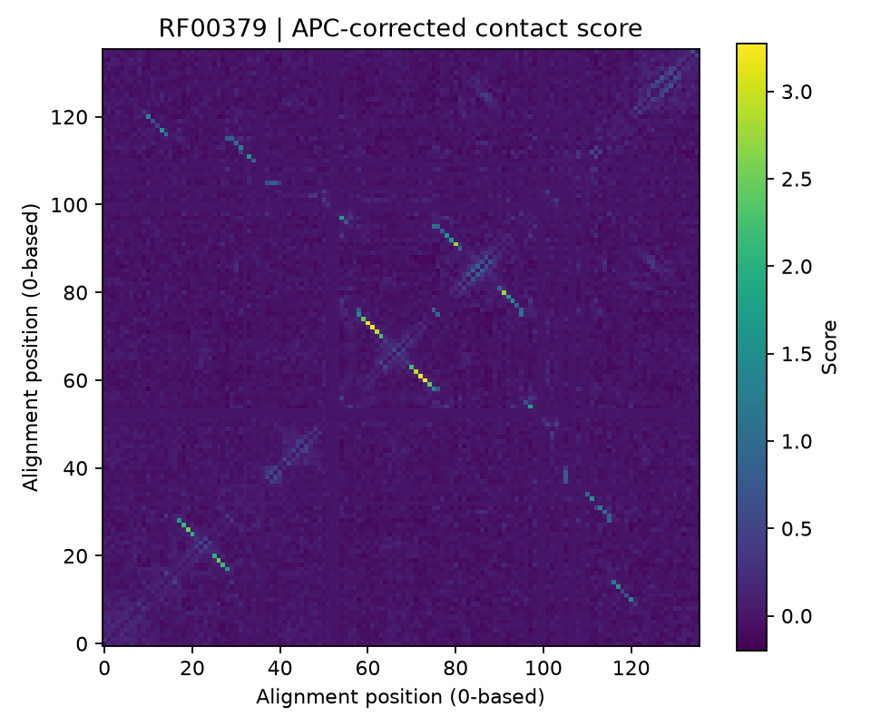

# Predict contacts · `contacts`

Rank pairs of alignment positions by the strength of their couplings:

```bash
adabmDCA contacts -p model/params.dat.gz -o contacts
```

Positions in contact in the three-dimensional structure tend to co-evolve, and a Potts model captures this as strong direct couplings, separated from the indirect correlations that propagate through chains of contacts. The score of a pair is the Frobenius norm of its coupling block, corrected for the background of each position (average product correction, APC).

## Inputs

| Option | Meaning |
| --- | --- |
| `-p`, `--path_params` | `params.dat(.gz)` or `ptt.h5` |
| `-d`, `--data` | Without `-p`: compute scores from the alignment with the fast mean-field approximation instead of a trained model |
| `--pseudocount` | Mean-field regularization (default 0.5) |
| `-o`, `-l` | Output folder and optional file prefix |

The mean-field route needs no training and is useful as a quick baseline; models trained by maximum likelihood (`bmDCA`) usually give better contact predictions.

## Outputs

| File | Content |
| --- | --- |
| `contact_map.csv` | Columns `position_i`, `position_j`, `score` for every pair |
| `contact_map.txt` | The same, headerless (format of earlier versions) |
| `contact_map.npy` | The full symmetric \(L\times L\) score matrix, zero on the diagonal |
| `contact_map.json` | Method and model metadata |
| `contact_map.png` | The score matrix as an image |

Positions are **zero-based alignment columns**.

{ width="480" }

*RF00379: bright pairs have high scores. The anti-diagonal stripes are the base-paired helices of the RNA secondary structure.*

## Interpreting the scores

- Scores **rank** pairs; they are not probabilities. The usual way to use them is to take the top \(L\) or \(L/2\) pairs, excluding pairs closer than a few positions along the sequence (\(|i-j| \le 4\) for proteins), which are trivially correlated.
- Gaps are excluded from the norm, and the couplings are first moved to the zero-sum gauge, so the score does not depend on how the model split its parameters between fields and couplings.
- Sparse models (`eaDCA`, `edgeDCA`, `edDCA`) give a score of exactly zero to pairs without couplings; their non-zero pairs are a candidate contact list by construction.
- Alignment positions must be mapped to residue numbers of a structure before comparing with a contact map.

## In Python

```python
from adabmDCA import load_model, predict_contacts

model = load_model("model/params.dat.gz", alphabet="rna")
contacts = predict_contacts(model=model)
pairs = contacts.to_long_dataframe()                     # position_i, position_j, score
top = pairs[pairs.position_j - pairs.position_i > 4].nlargest(136, "score")
```

Definition: [contact scores](../quantities/derived.md#contact-scores).
